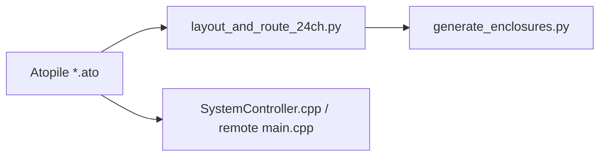

# Cross-Domain Co-Design Sync

Four layers must describe the **same** 24-channel machine. The 11-channel PROFET carrier is legacy.



Authoritative table: [co_design_verification_matrix.md](./references/co_design_verification_matrix.md).  
Active logic defects / residuals: `docs/logic_audit_2026-09-11.md`.

---

## Pitfalls (current)

1. **11-ch PCB + 24-ch firmware:** GPIO 2/16/18 mean LED vs LPG/gen/awning. Never mix.
2. **DevKit header view:** J1 pin 21 = 5 V, J3 pin 1 = GND (v1.1). Do not reconnect VIN to J3 pin 1.
3. **XIAO silk ≠ GPIO number:** D3=21, D4=22, D10=18. GPIO 9 is BOOT.
4. **Button index ≠ channel index:** Entrance button 4 is the pump (Ch 4); encoder is button 7 (focus zone, not Ch 0).
5. **Script-invented pads:** If the layout script adds a terminal, the same net must exist in `VanCentralController24Ch`.
6. **Enclosure pitch:** 24-ch PCB 180×110 mm → standoffs 170×100 mm. 11-ch 150×95 mm → 140×85 mm.

---

## Change protocol

1. **Atopile** — edit `*.ato`, keep flyback on PROFET/load+, BAT54S on ADC, D10→GPIO18.
2. **Layout** — update `layout_and_route_24ch.py` (or the remote script). Run DRC to 0/0.
3. **Firmware** — `DEFAULT_24CH_CONFIG` and `DEFAULT_REMOTE_MAPPINGS` live in `SystemController.cpp`, not a `PIN_CH0` header. Remote pins live in `firmware/remote/src/main.cpp`. Then:

```bash
pio test -d firmware/central -e native
pio test -d firmware/remote -e native
```

4. **CAD** — `pcb_length` / `pcb_width` / hole pitch in `generate_enclosures.py` must match the PCB just routed.

---

## Checklist

- [ ] Matrix row updated for every pin or button index change
- [ ] Firmware and Atopile GPIO match that row
- [ ] Layout script net names match Atopile
- [ ] Enclosure holes match layout
- [ ] Native tests pass
- [ ] Dashboard does not call a board “production ready” if firmware identity differs
