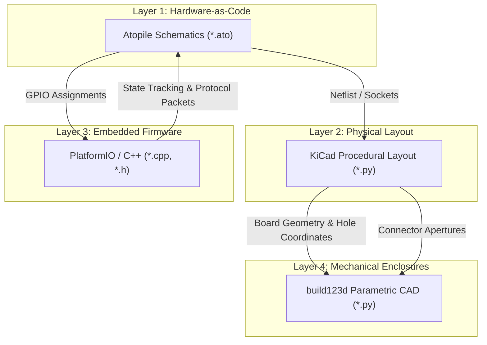

# Cross-Domain Co-Design Synchronization & Audit Guide

This skill provides an authoritative verification process for managing cross-domain dependencies in the **VanNOW** camper van automation ecosystem. In multi-board cyber-physical architectures, changes in one engineering layer (electronic schematics, physical PCB routing, firmware logic, or parametric 3D enclosures) propagate across the entire system.

---

## The Four Engineering Layers



---

## Common Cross-Domain Pitfalls in VanNOW

1. **DevKit Perspective Inversions:**
   - *Symptom:* Pin J3-Pin 1 connected to 5V power, shorting VCC directly to GND.
   - *Rule:* Always cross-verify whether Atopile female header pinouts reflect **Top View** (looking down on the dev board) or **Bottom View** (looking at carrier female headers).
2. **Firmware Pinout Desynchronization:**
   - *Symptom:* Reassigning a channel from GPIO 4 to GPIO 15 in Atopile without updating `SystemController.h`.
   - *Rule:* Any net modification in `*.ato` mandates an immediate search in `firmware/central/src/` and `firmware/remote/src/` to update pin definitions, followed by `pio test -e native`.
3. **Connector / Wall Aperture Clashing:**
   - *Symptom:* Shifting Phoenix Contact terminal blocks 5 mm to the right causes wires to hit the 3D-printed enclosure wall.
   - *Rule:* Standoff coordinates and aperture cutouts in `hardware/enclosures/scripts/generate_enclosures.py` must derive their bounding boxes directly from the PCB outline and terminal positions in `layout_and_route.py`.
4. **Wireless Channel ID Mismatch:**
   - *Symptom:* Remote transmitter sending toggle command for Channel 3, while Central Controller maps Channel 3 to Water Pump instead of Kitchen Light.
   - *Rule:* Channel IDs (0..23) are unified across `protocol.h`, `SystemController.h`, and `cockpit.ato`.

---

## Step-by-Step Co-Design Change Protocol

Whenever an engineering change is initiated:

### Phase 1: Schematic & Netlist (Atopile)
1. Update `*.ato` file with new pins, connections, or components.
2. Compile and assert: `ato build` passes with zero net shorts.

### Phase 2: PCB Procedural Routing (`pcbnew`)
1. Update `layout_and_route.py` with modified footprint locations or trace nets.
2. Run routing script:
   ```bash
   flatpak run --command=python3 org.kicad.KiCad hardware/central-pcb/scripts/layout_and_route.py
   ```
3. Verify headless DRC produces 0 unconnected nets and 0 violations.

### Phase 3: Firmware Pin Mapping & Logic (PlatformIO)
1. Update GPIO constants in `SystemController.h` or `BinaryMatrixHandler.h`.
2. Verify native test suites:
   ```bash
   pio test -d firmware/central -e native
   pio test -d firmware/remote -e native
   ```

### Phase 4: Mechanical Enclosure Fit Check (`build123d`)
1. Verify PCB length, width, mounting hole radii, and connector windows in `hardware/enclosures/scripts/generate_enclosures.py`.
2. Export STEP solids and run electromechanical clash detection per the `pcb-rendering` skill.

---

## Authoritative Reference Tables
Detailed channel mappings and pin assignments: [co_design_verification_matrix.md](./references/co_design_verification_matrix.md).
