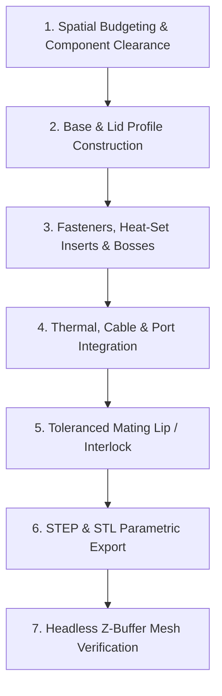

# Parametric 3D CAD Enclosure Design & Verification Guide

This skill provides an authoritative, production-grade methodology for modeling mechanical enclosures, cradles, and electronic housings using **Python Code-as-CAD (`build123d` on OpenCASCADE)** and verifying them through **headless software Z-buffer rasterization**.

---

## Core Engineering Directives

1. **Watertight Manifold Topology First:** Construct 3D bodies from clean, continuous 2D sketches (`BuildSketch` + `RectangleRounded` / `SlotOverall`) extruded into solids. Avoid fragile post-hoc fillets or hollow shells generated via global `offset()` on complex geometry.
2. **Fastener Land & Shoulder Integrity:** Never allow a counterbore to punch through or dangerously thin a mounting wall. Always enforce:
   $$\text{Wall Thickness} - \text{Counterbore Depth} \ge \text{Clamping Shoulder} \ge 1.5\,\text{mm}$$
3. **Dedicated Spatial Isolation:** Never overlap structural features. PCB standoffs and magnet pockets must have dedicated, non-colliding XY coordinates and guaranteed floor backing:
   $$\text{Floor Thickness} - \text{Magnet Pocket Depth} \ge 1.2\,\text{mm}$$
4. **Interlocking Stepped Joints:** Every two-part enclosure (base + lid or body + faceplate) must feature an interlocking stepped perimeter flange (tongue-and-groove) with appropriate 3D printing or injection molding clearance ($0.2\,\text{mm} \text{ to } 0.4\,\text{mm}$) to prevent lateral shear, dust ingress, and light/EMI bleed.
5. **Ergonomic Extraction Mechanics:** Any device held in a docking cradle by magnetic force ($F \ge 10\,\text{N}$) MUST provide dual finger/thumb extraction scallops so users can securely pinch and remove the unit without tools.

---

## Enclosure Design Workflow



---

## Step-by-Step Implementation Guide

### 1. Unified 2D Sketches vs. Fragile Post-Hoc Boolean Operations
In OpenCASCADE (`build123d` / CadQuery), joining separate 3D blocks and then calling global topological selectors (e.g. `base.edges().filter_by(Axis.Z)`) frequently produces non-manifold edges, vertex singularities, or topological naming failures.

* **Best Practice:** Define the entire perimeter (including mounting ears, corner radii, and perimeter offsets) in a single unified 2D sketch, then extrude:
  ```python
  with BuildPart() as base:
      with BuildSketch(Plane.XY) as s_floor:
          RectangleRounded(length, width, 6.0)
          with Locations((-length / 2 - 11.0, 0), (length / 2 + 11.0, 0)):
              RectangleRounded(22.0, 52.0, 4.0)
              Circle(radius=2.25, mode=Mode.SUBTRACT)  # M4 mounting holes
      extrude(amount=floor_thickness)
  ```
* Detailed Guide: [build123d_best_practices.md](./references/build123d_best_practices.md)

---

### 2. Fasteners, Screw Bosses & Heat-Set Inserts
Threaded fasteners in plastic must never thread directly into bare PLA/ABS/PETG. Use **brass threaded heat-set inserts** (Ruthex / McMaster):

| Thread Size | Outer Diameter ($D_{insert}$) | Recommended Pilot Hole ($D_{pilot}$) | Minimum Insert Depth ($H_{hole}$) | Boss Outer Diameter ($D_{boss}$) |
| :--- | :--- | :--- | :--- | :--- |
| **M2** | $3.2\,\text{mm}$ | $3.0 - 3.1\,\text{mm}$ | $4.0\,\text{mm}$ | $5.0\,\text{mm}$ |
| **M2.5** | $3.6\,\text{mm}$ | $3.4 - 3.5\,\text{mm}$ | $4.5\,\text{mm}$ | $6.0\,\text{mm}$ |
| **M3** | $4.2\,\text{mm}$ | $4.0 - 4.1\,\text{mm}$ | $5.5 - 6.0\,\text{mm}$ | $7.5 - 8.5\,\text{mm}$ |
| **M4** | $5.6\,\text{mm}$ | $5.2 - 5.4\,\text{mm}$ | $7.5 - 8.0\,\text{mm}$ | $10.0 - 11.0\,\text{mm}$ |

* **Boss Gusseting:** Always tie tall corner bosses into the adjacent enclosure walls with triangular fillets or webs to prevent snapping under screw torque.
* Detailed Guide: [enclosure_design_rules.md](./references/enclosure_design_rules.md)

---

### 3. Avoiding the `build123d` Global Plane-Reset Trap
Passing a global plane constant (such as `Plane.XZ`, `Plane.YZ`, or `Plane.XY`) into `BuildSketch()` **resets the sketch origin to $(0, 0, 0)$**, completely discarding any enclosing `with Locations(...)` scope!

```python
# ❌ BUG: Sketch origin resets to (0, 0, 0) on the XZ plane!
with Locations((50, -width/2, 20)):
    with BuildSketch(Plane.XZ):
        Circle(8.0)
    extrude(amount=5.0)

# ✅ CORRECT: Use 3D primitives with explicit rotation:
with Locations((50, -width/2, 20)):
    Cylinder(radius=8.0, height=5.0, rotation=(90, 0, 0))

# ✅ CORRECT: Or offset the plane explicitly:
with BuildSketch(Plane.XY.offset(height)) as s:
    RectangleRounded(80, 80, 4.0)
extrude(amount=-6.0, mode=Mode.SUBTRACT)
```

---

### 4. Headless CAD Mesh Verification (Software Z-Buffer)
Standard Matplotlib 3D (`mplot3d` / `Poly3DCollection`) sorts faces solely by centroid distance (Painter's algorithm). For non-convex shells or hollow enclosures, it produces severe visual overlap errors, inverted depths, and triangulated wireframe spiderwebs.

* **Production Verification Requirement:** Always verify STL meshes using a pure **software Z-buffer rasterizer** with:
  1. Backface culling in screen space (`cross2d < 0`).
  2. Per-pixel depth testing ($Z_{frag} < Z_{buffer}[y, x]$).
  3. Directional three-point Blinn-Phong lighting with positive $Z_{cam}$ light vectors.
  4. Subtle CAD feature crease lines (`angles > 30°`) depth-tested against the buffer.
* Detailed Guide: [mesh_rendering_and_verification.md](./references/mesh_rendering_and_verification.md)

---

## Verification Checklist

Before releasing CAD models or generating production fabrication files, verify:

- [ ] **Watertight Manifold Solid:** `part.is_valid == True` and `mesh.is_watertight == True`.
- [ ] **Z-Coordinate Clearance:** No negative-Z protrusions into mounting surfaces or floors.
- [ ] **Floor Backing:** Magnet pockets and blind standoff holes leave $\ge 1.2\,\text{mm}$ of solid plastic backing.
- [ ] **Counterbore Clamping Shoulder:** Counterbored screw heads leave $\ge 1.5\,\text{mm}$ of solid material.
- [ ] **Stepped Perimeter Joint:** Interlocking lip and groove present with $0.2\,\text{mm}$ to $0.4\,\text{mm}$ clearance.
- [ ] **Thermal & Cable Ports:** Glands have clearance for locknuts; heat sources have convective vent slots.
- [ ] **Extraction Ergonomics:** Magnetic cradles have finger/thumb grip notches ($\ge 14\,\text{mm}$ radius).
