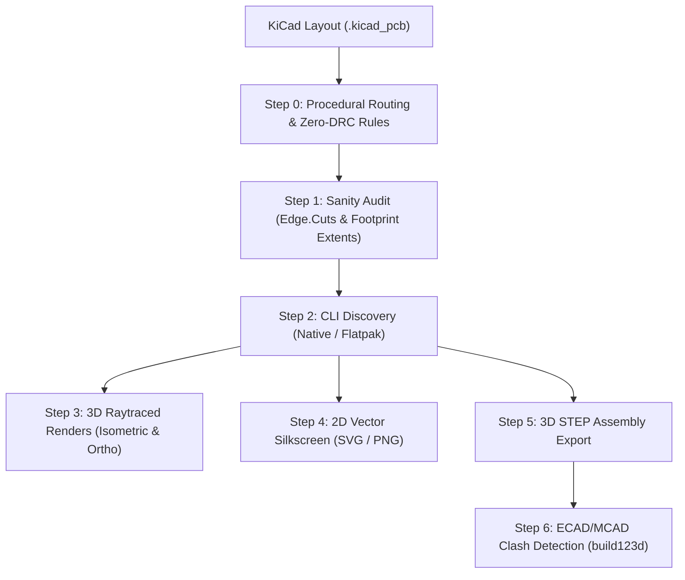

# PCB 3D Rendering, Visualization & CAD Assembly Guide

This skill provides an authoritative, automated methodology for generating photorealistic 3D raytraced renders, 2D vector fabrication drawings, and populated 3D STEP mechanical models from KiCad PCB layouts, with direct integration into Python Code-as-CAD (`build123d` / OpenCASCADE) for electromechanical clearance verification.

---

## Core Engineering Directives

1. **Closed Board Outline (`Edge.Cuts`) Integrity:** Never attempt to render a PCB without a continuous closed polygon on layer `Edge.Cuts`. Missing outlines trigger fallback bounding boxes, stripping chamfers, radius corners, and mounting hole apertures.
2. **Orphan Footprint Origin (0, 0) Audit:** Always inspect footprint coordinates before rendering. Netlist synchronization and Hardware-as-Code generators (e.g. Atopile `ato build`) often place unpositioned components at `(0, 0)`, artificially inflating the board bounding box by hundreds of millimeters.
3. **Physical Stackup Material Fidelity:** Enforce `--use-board-stackup-colors` during rendering so that realistic solder mask finishes (Matte Black, Forest Green, Deep Blue) and copper platings (ENIG gold vs. HASL silver) reflect physical reality.
4. **Populated 3D STEP Export for ECAD/MCAD Interlock:** Always export populated STEP models (`pcb export step --subst-models`) alongside visual images. A visual render verifies aesthetics; the STEP solid verifies spatial clearance inside the physical enclosure.
5. **Universal Headless CLI Discovery:** Scripts must transparently support both native `kicad-cli` and containerized / sandboxed Flatpak installations (`org.kicad.KiCad`), ensuring CI/CD and developer workstation reproducibility.

---

## End-to-End PCB Rendering & CAD Workflow



---

## Step-by-Step Implementation Guide

### Step 0: Procedural Layout & DRC Zero-Violation Physical Routing Rules

To ensure layouts achieve 0 DRC violations, 0 unconnected items, and 0 warnings before raytracing and CAD export:

1. **Multi-Channel Axial Alignment (Zero-Jog Routing):**
   When designing multi-channel input or output stages (e.g. terminal blocks, button matrices), align all associated filter capacitors, pull-up resistors, and diodes at the exact X-coordinate of their corresponding connector pad. This enables single-segment, direct vertical drops on signal nets without horizontal jogs, preserving wide, uninterrupted corridors for power buses and ground planes.

2. **Outer-Flank Feeds for Two-Terminal Passives (Short Prevention):**
   Two-terminal SMD passives (0805, 0603) have their pads situated along a single axis (e.g. Pad 1 on the West, Pad 2 on the East). Power and ground traces feeding Pad 1 MUST approach from the outside (West flank), and traces feeding Pad 2 must approach from the opposite flank (East). Routing across the component body or near the opposite pad on the same copper layer causes dead shorts (`[shorting_items]`) or solder mask bridges (`[solder_mask_bridge]`).

3. **Mounting Hole Geometric Edge Clearance (The Dog-Leg Rule):**
   KiCad board constraints enforce minimum edge clearance (typically 0.50 mm) against all `Edge.Cuts` geometry, which includes circular cutouts for mechanical mounting holes. The clearance between any track and a circular mounting hole center must satisfy:
   Euclidean Distance = √((x_track - x_hole)² + (y_track - y_hole)²) ≥ r_hole + w_track / 2 + clearance_min
   When running along board edges near mounting holes, dog-leg the trace inward (e.g., dog-legging inward by 1.5 mm around the hole) to guarantee clearance well above the 0.50 mm threshold.

4. **Orthogonal Two-Layer Bus Crossing (Layer Jumpers):**
   In dense 2-layer layouts where a primary horizontal power trunk (e.g. VCC along Y = 4.5 mm on B.Cu) intersects a perpendicular vertical signal trunk (e.g. Wakeup bus along X = -17.5 mm on B.Cu), never route both on the same layer. Transition the perpendicular signal trace to the opposite layer (F.Cu) using a pair of through-hole vias (e.g. at Y = 6.0 mm and Y = 3.0 mm) to jump cleanly over the power trunk with zero clearance violations.

5. **Eliminating Starved Thermal Reliefs & Isolated Ground Islands:**
   Long horizontal or diagonal traces across the bottom layer (B.Cu) can dissect the copper ground fill, severing copper continuity and creating isolated islands. When component ground pads attach to these unstitched islands, KiCad DRC flags:
   `[starved_thermal]: Thermal relief connection to zone incomplete (1 spokes connected to isolated island)`.
   Remedy:
   - Route a dedicated perimeter ground bus track (width 0.35 mm - 0.40 mm) directly linking all connector ground pads together.
   - Place dedicated ground stitching vias adjacent to each connector ground pad, stitching the isolated island back into the continuous top ground plane (F.Cu).

6. **Strict Node Termination to Prevent Dangling Track Warnings:**
   Every track segment must start and terminate exactly at the coordinate center of a pad or via. Running a bus trace beyond its final tap point creates an unconnected stub that triggers `[track_dangling]` DRC warnings. Ensure all bus end-points coincide precisely with the terminal pad or via coordinate.

7. **Via-in-Pad Avoidance on Standard SMD Packages:**
   Placing through-hole vias directly inside 0805/0603 SMD pads can cause solder wicking during reflow or hand-soldering. Drop vias on the routing bus line (e.g., offset by 1.5 mm) and use a short 0.25 mm surface stub to feed the component pad.

---

### Step 1: Pre-Render Layout Sanity Checks

Before invoking the renderer, verify that the PCB layout satisfies three critical geometrical conditions:

#### 1.1 Closed Outline on `Edge.Cuts`
A valid board outline must exist on layer `Edge.Cuts`. In KiCad S-expression syntax:
```scheme
(gr_rect (start X1 Y1) (end X2 Y2)
    (stroke (width 0.15) (type solid))
    (fill none)
    (layer "Edge.Cuts")
    (uuid "...")
)
```

#### 1.2 Physical Mounting Hole Apertures
Screw mounting holes cut through the FR4 substrate should be explicitly present on `Edge.Cuts` as closed circles (e.g., dia 3.2 mm for M3 fasteners):
```scheme
(gr_circle (center X Y) (end X+1.6 Y)
    (stroke (width 0.15) (type solid))
    (fill none)
    (layer "Edge.Cuts")
    (uuid "...")
)
```
In 3D raytracing, these cutouts let light and ground plane shadows pass cleanly through the board.

#### 1.3 Audit Orphan Footprints at (0, 0)
Run a quick coordinate scan to confirm no parts are stranded at the coordinate origin:
```python
import re

with open("path/to/board.kicad_pcb") as f:
    text = f.read()

footprints = re.findall(r'\(footprint\s+"([^"]+)"[\s\S]*?\(at\s+([-\d.]+)\s+([-\d.]+)', text)
orphans = [fp for fp, x, y in footprints if float(x) == 0.0 and float(y) == 0.0]
assert not orphans, f"Found orphan footprints at origin (0, 0): {orphans}"
```

---

### Step 2: Portable Headless CLI Discovery

KiCad 7, 8, and 10 provide `kicad-cli`. On Linux developer workstations and immutable OS distributions (e.g. Fedora Silverblue/Kinoite), KiCad is frequently installed via Flatpak.

Implement robust discovery in Python:
```python
import shutil
import subprocess

def get_kicad_cli():
    # 1. Check native system PATH
    native = shutil.which("kicad-cli")
    if native:
        return [native]

    # 2. Check Flatpak sandbox
    flatpak = shutil.which("flatpak")
    if flatpak:
        res = subprocess.run(
            [flatpak, "run", "--command=kicad-cli", "org.kicad.KiCad", "--version"],
            capture_output=True, text=True
        )
        if res.returncode == 0:
            return [flatpak, "run", "--command=kicad-cli", "org.kicad.KiCad"]

    raise RuntimeError("kicad-cli not found in PATH or Flatpak org.kicad.KiCad")
```

---

### Step 3: Photorealistic 3D Raytracing (`pcb render`)

KiCad's internal raytracer computes ambient occlusion, multi-bounce reflections, and ground plane contact shadows.

#### Recommended 3D Isometric View (with Floor Shadows)
```bash
flatpak run --command=kicad-cli org.kicad.KiCad pcb render \
  --output central_pcb_isometric.png \
  --rotate -50,0,40 \
  --perspective \
  --floor \
  --use-board-stackup-colors \
  --quality high \
  --width 2560 \
  --height 1440 \
  board.kicad_pcb
```

#### Recommended Orthographic Top & Bottom Inspection Views
```bash
# Top Inspection
flatpak run --command=kicad-cli org.kicad.KiCad pcb render \
  --output central_pcb_top.png \
  --side top \
  --use-board-stackup-colors \
  --quality high \
  --width 2560 \
  --height 1440 \
  board.kicad_pcb

# Bottom Inspection
flatpak run --command=kicad-cli org.kicad.KiCad pcb render \
  --output central_pcb_bottom.png \
  --side bottom \
  --use-board-stackup-colors \
  --quality high \
  --width 2560 \
  --height 1440 \
  board.kicad_pcb
```

- Detailed reference: [raytracing_parameters_guide.md](./references/raytracing_parameters_guide.md)

---

### Step 4: 2D Vector Silkscreen & Fabrication Plots

Generate clean vector SVGs and high-resolution PNGs for wiring guides and assembly manuals:

```bash
# 1. Export SVG with copper, silkscreen, soldermask, and board boundary
flatpak run --command=kicad-cli org.kicad.KiCad pcb export svg \
  --mode-single \
  --layers F.Cu,F.SilkS,F.Mask,Edge.Cuts \
  --exclude-drawing-sheet \
  --page-size-mode 2 \
  -o central_pcb_silkscreen.svg \
  board.kicad_pcb

# 2. Rasterize to 300 DPI PNG via ImageMagick
magick -density 300 central_pcb_silkscreen.svg central_pcb_silkscreen.png
```

---

### Step 5: Populated 3D STEP Assembly Export

Export the complete 3D mechanical assembly of the board and its populated electronic components into a single STEP solid:

```bash
flatpak run --command=kicad-cli org.kicad.KiCad pcb export step \
  --output central_pcb.step \
  --subst-models \
  board.kicad_pcb
```
*Note: The `--subst-models` flag automatically substitutes VRML (`.wrl`) models with exact parametric STEP (`.step`) equivalents.*

---

### Step 6: Automated ECAD/MCAD Clash Detection (`build123d`)

Verify that the PCB fits inside the mechanical enclosure, standoffs align with holes, and tall components clear the lid:

```python
from build123d import *

# 1. Import enclosure base and lid
base = import_step("hardware/enclosures/models/central_enclosure_base.step")
lid = import_step("hardware/enclosures/models/central_enclosure_lid.step")

# 2. Import populated PCB assembly
pcb = import_step("hardware/central-pcb/renders/profet.step")

# 3. Position PCB on top of 12mm standoffs (Z = floor_thickness + standoff_height)
standoff_z = 3.5 + 12.0
pcb_positioned = pcb.locate(Location((0, 0, standoff_z)))

# 4. Programmatic collision test against enclosure walls and lid
base_clash = base.intersect(pcb_positioned)
assert base_clash.volume == 0, f"Clash with base enclosure detected: volume = {base_clash.volume} mm³"

lid_clash = lid.locate(Location((0, 0, 45.0))).intersect(pcb_positioned)
assert lid_clash.volume == 0, f"Clash with lid detected: volume = {lid_clash.volume} mm³"

print("ECAD/MCAD Verification Passed: Zero geometric interference detected!")
```

- Detailed reference: [ecad_mcad_clash_detection.md](./references/ecad_mcad_clash_detection.md)

---

## Troubleshooting & Common Pitfalls

| Symptom / Error | Root Cause | Engineering Solution |
| :--- | :--- | :--- |
| `[shorting_items]: Items shorting two nets` | Track routed through an adjacent pad, across an SMD passive body, or directly over a ground stitching via. | Approach 2-terminal SMD pads from the outer flank only. Shift power rails to clear adjacent pins by ≥ 1.0 mm. |
| `[tracks_crossing]: Tracks crossing` | Two different nets routed across each other on the same copper layer (e.g. VCC trunk and Wakeup bus on B.Cu). | Transition one net to the opposite copper layer using a 2-via orthogonal jumper. |
| `[copper_edge_clearance]: Board edge clearance violation` | Track passes within 0.50 mm of an `Edge.Cuts` feature (outer perimeter or circular mounting hole). | Apply the Euclidean distance formula and dog-leg the track inward around the mounting hole. |
| `[starved_thermal]: Thermal relief connection to zone incomplete` | Long traces on B.Cu dissect the copper pour, isolating ground islands around screw terminal pins. | Route a solid perimeter ground bus on B.Cu and add dedicated stitching vias to connect islands directly to F.Cu ground. |
| `[track_dangling]: Track has unconnected end` | Bus trunk extends past the final component tap point without ending on a pad or via coordinate. | Truncate the bus track so its endpoint coordinates match the final pad or via center exactly. |
| `[solder_mask_bridge]: Front solder mask aperture bridges items with different nets` | Clearance between a track and a different net pad is less than the solder mask minimum web width (~0.1 mm - 0.2 mm). | Reroute trace to provide ≥ 0.3 mm clearance from the pad boundary. |
| `Warning: Board outline is missing or malformed.` | Layer `Edge.Cuts` lacks a closed rectangle or polygon. | Add a closed `(gr_rect ...)` or `(gr_poly ...)` around the component area on `Edge.Cuts`. |
| Rendered board is huge and mostly empty space. | An unplaced footprint (e.g. newly added resistor) was defaulted to `(0, 0)`. | Scan footprints for `(at 0 0)` and move the component adjacent to its functional circuit group. |
| Component 3D models appear as blank or missing blocks. | Footprint references `${KICADx_3DMODEL_DIR}` which isn't mapped inside Flatpak or custom path. | Pass `--define-var KICAD10_3DMODEL_DIR=/app/extensions/Library/Packages3D/3dmodels` or use standard library packages. |
| Mounting holes do not let light through in raytracing. | Mounting holes are defined as pads or silkscreen rather than through-holes. | Define mounting hole cutouts as `(gr_circle ... (layer "Edge.Cuts"))` or use plated through-hole footprints with drill holes. |
| Board renders with default green rather than custom color. | Missing `--use-board-stackup-colors` flag. | Add `--use-board-stackup-colors` to respect the Matte Black / Purple stackup color defined in the board setup. |

---

## Pre-Render Verification Checklist

Before publishing renders or ordering manufactured boards, ensure:

- [ ] **Continuous Board Edge:** Closed rectangle/polygon on `Edge.Cuts` with proper corner radii (e.g., R=2.0 mm).
- [ ] **Mounting Hole Alignment:** Corner mounting hole centers match the 3D enclosure standoff centers (e.g. 140 mm × 85 mm pitch).
- [ ] **No (0, 0) Orphan Components:** All footprints explicitly positioned in functional blocks.
- [ ] **Component 3D Models:** Sockets, terminals, PROFETs, and diodes have valid 3D shapes attached.
- [ ] **Camera Angle:** Isometric 3/4 axonometric perspective (`--rotate -50,0,40 --perspective --floor`).
- [ ] **Visual Stackup Colors:** `--use-board-stackup-colors` enabled.
- [ ] **STEP Assembly Export:** 3D solid `.step` exported and verified against enclosure CAD.
