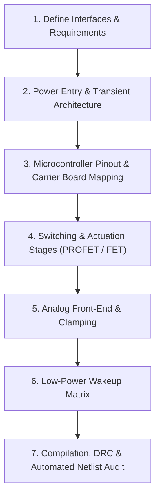

# Electronic Schematic Design & Verification Guide

This skill provides a standardized, mathematically rigorous procedure for designing, auditing, and compiling electronic schematics, with specific emphasis on **Hardware-as-Code (Atopile)**, **Automotive 12V/24V Systems**, and **Low-Power Embedded Microcontrollers** (ESP32-S3, ESP32-C6).

---

## Core Principles

1. **Datasheet-First Verification:** Never trust third-party pinout graphics or AI hallucinated pin assignments. Always trace physical pin numbers to official manufacturer schematics and verify top vs. bottom board perspective.
2. **Safety & Automotive Hardening:** Every vehicle-connected DC rail must incorporate reverse polarity protection, transient voltage suppression (ISO 7637-2 / ISO 16750-2), and high-side switching.
3. **Impedance & Bandwidth Matching:** Match analog sensor output impedance to the microcontroller ADC sampling characteristics (R_Th ≤ 10 kΩ, reservoir capacitor C_f = 100 nF). Never clamp high-impedance ADC inputs with low-voltage Zener diodes.
4. **Compile-Time Hardware Constraints:** In Hardware-as-Code (Atopile), enforce programmatic assertions (`assert vcc != gnd`) to detect short circuits, inverted rails, and pin conflicts before PCB layout.

---

## Step-by-Step Schematic Design Workflow



### Step 1: Power Entry & Automotive Protection
When designing 12V/24V automotive supplies:
1. **Reverse Polarity Protection:** Use a high-side P-Channel MOSFET with a 15V Zener clamp between Gate and Source to prevent gate oxide punch-through during load dumps.
   - Detailed guide: [automotive_power_entry.md](./references/automotive_power_entry.md)
2. **TVS Clamping (ISO 7637-2 / ISO 16750-2):**
   - Reverse Standoff Voltage: V_RWM ≥ 24 V (to survive 24V jump-starts).
   - Maximum Clamping Voltage: V_C ≤ 38 V (below the 41 V breakdown of downstream silicon).
   - Recommended part: DO-218AB automotive TVS (e.g., `SM8S24A` or `SLD8S24A`).
3. **Buck Converter π-Filter Damping:** Follow the Middlebrook Criterion to prevent negative input resistance oscillation. Add an electrolytic damping capacitor (C_d ≥ 4 · C_in2) with series damping resistor (R_d ≈ √(L / C_in2)).

---

### Step 2: Microcontroller Carrier Board & Pinout Mapping
When embedding commercial dev boards (e.g., ESP32-S3 DevKitC-1, Seeed XIAO ESP32-C6):
1. **Perspective Check:** Verify whether the datasheet pinout is **Top View** (looking at components) or **Bottom View** (looking at solder pins). Carrier board female headers interface with the bottom of the module.
2. **Atopile Architectural Separation:**
   - Define a generic physical header component (`Header_1x22`) with strict pin-to-pad bindings (`signal pin_1 ~ pin 1`).
   - Define semantic interfaces (`Power`, `UART`, `SPI`).
   - Connect the semantic signals to the physical header pins inside the module wrapper.
3. **Compile-Time Assertions:**
   ```ato
   assert power_5v.vcc != power_5v.gnd
   assert j1_left.pin_21 != j3_right.pin_1
   ```
4. Detailed guide: [hardware_as_code_atopile.md](./references/hardware_as_code_atopile.md)

---

### Step 3: Power Switching & PWM Limitations
When switching automotive loads (lights, pumps, fans):
1. **High-Side Switching Only:** Keep chassis ground direct. Use Smart High-Side Switches (Infineon PROFET+ BTS5008-1EKB) with integrated short-circuit, over-temperature, and active inductive clamping.
2. **PWM Frequency Calculation:**
   - Automotive PROFET switches intentionally throttle slew rates (dV/dt) for CISPR 25 Class 5 EMI compliance (t_ON, t_OFF ≈ 150 µs - 250 µs).
   - **Never operate PROFETs at standard 5 kHz PWM.** The period (200 µs) is shorter than the switching transition (500 µs), leading to thermal runaway.
   - **Mandatory PWM Frequency:** Configure firmware PWM between **100 Hz and 400 Hz** (nominally **200 Hz**).
3. **Current Sense (IS) Protection:** When a PROFET faults, the IS pin sources up to 7 mA, generating > 8 V across R_IS. Clamp the IS line to 3.3V using a dual Schottky diode (`BAT54S`) and a series resistor (R_series ≥ 2.2 kΩ).
4. Detailed guide: [power_switching_profet.md](./references/power_switching_profet.md)

---

### Step 4: Analog Front-End & ADC Protection
When measuring voltages with microcontroller SAR ADCs (e.g., ESP32 ADC):
1. **Avoid Low-Voltage Zener Diodes:** 3.3V Zener diodes (e.g., `BZX84-C3V3`) have a very soft knee and leak tens of microamps below breakdown. Across a 15 kΩ divider, this introduces a **≈ 5 V measurement error**!
2. **Use Schottky Rail Clamping:** Connect a `BAT54S` Schottky diode to the 3.3V rail. It provides sharp overvoltage clamping at V_DD + 0.3 V with negligible reverse leakage (< 100 nA).
3. **SAR ADC Reservoir Capacitor:** ESP32 ADCs draw instantaneous charge during sampling (C_sample ≈ 5 pF). Place a 100 nF ceramic capacitor directly at the ADC pin to buffer the sample-and-hold circuit and provide anti-aliasing.
4. Detailed guide: [analog_frontends.md](./references/analog_frontends.md)

---

### Step 5: Low-Power Deep Sleep Wake-Up Design
When designing battery-powered remotes (e.g., ESP32-C6):
1. **LP-GPIO vs. HP-GPIO Constraints:** In Deep Sleep, the High-Power (HP) domain is completely powered off. Only Low-Power (LP) GPIOs (GPIO 0–7) can wake the MCU via `EXT1`.
   - On the Seeed Studio XIAO ESP32-C6, header pins `D0`, `D1`, `D2` are LP-GPIOs. Header pin `D3` is GPIO 21 (HP-GPIO) and **cannot wake the chip**.
2. **Hardware Diode-OR Wakeup Matrix:**
   - If more physical buttons are needed than available LP-GPIO pins, route each button to an HP-GPIO for identification, and diode-OR all buttons through low-leakage Schottky/switching diodes (`1N4148W` or `BAT54C` in SOD-123) to a single shared LP-GPIO wake pin.
   - **Diode Polarity:** Connect Diode Anode to the shared `wakeup_bus` (pulled up to 3.3V via 47 kΩ) and Cathode to the button/switch sense line (pulled to GND upon activation).
   - **Debounce Filtering:** Include a 10 kΩ pull-up and 100 nF ceramic debounce capacitor per switch channel to eliminate mechanical contact bounce while maintaining zero deep-sleep leakage.
3. Detailed guide: [ultra_low_power_wakeups.md](./references/ultra_low_power_wakeups.md)

---

### Step 6: PCB 3D Rendering, Mechanical CAD Export & Fit Check
Before fabricating PCBs, verify component clearances, connector ergonomics, and enclosure mechanical fit:
1. **Raytraced 3D Render:** Run `kicad-cli pcb render` with perspective and floor shadows to inspect physical component spacing and silkscreen legibility.
2. **Populated 3D STEP Export:** Export board solid via `kicad-cli pcb export step --subst-models` and import into `build123d` enclosure models to verify standoff alignment and port clearances.
3. Detailed guide: [pcb_rendering_and_visualization.md](./references/pcb_rendering_and_visualization.md)

---

## Verification & Pre-Fabrication Checklist

Before ordering PCBs or committing schematic changes, verify every item in this checklist:

- [ ] **Physical Header Pinout:** Verified against the manufacturer's primary schematic PDF (not marketing pinout diagrams).
- [ ] **Power/GND Isolation:** Verified that V_IN and GND pins are not shorted or inverted on the carrier board.
- [ ] **Reverse Polarity Protection:** High-side P-MOSFET configured with Source to V_IN and Drain to Load, with 15V Zener across Gate-Source.
- [ ] **Load Dump TVS Rating:** DO-218AB TVS diode with V_RWM ≥ 24 V and V_C ≤ 38 V.
- [ ] **PROFET PWM Frequency:** Firmware configured for 100 Hz - 400 Hz (nominally 200 Hz).
- [ ] **PROFET IS Clamp:** Dual Schottky diode (`BAT54S`) clamping IS to 3.3V with R_series ≥ 2.2 kΩ.
- [ ] **ADC Divider Impedance:** Thévenin resistance R_Th ≤ 15 kΩ with a 100 nF ceramic reservoir capacitor at the MCU pin.
- [ ] **No Low-Voltage Zeners:** No 3.3V Zeners on high-impedance analog lines.
- [ ] **Deep Sleep Wakeup Pins:** All wake switches connected exclusively to LP-GPIOs (or diode-ORed to an LP-GPIO).
- [ ] **Atopile Compilation:** `ato build` passes with zero errors and electrical checks validated.
