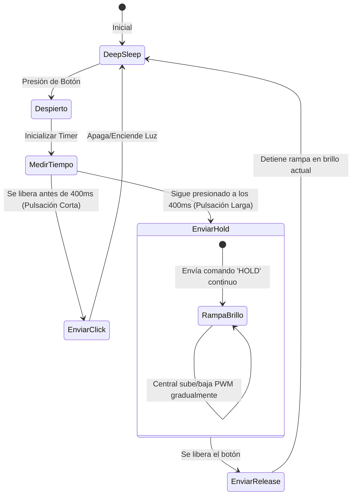

# Control de Atenuación de Luces con MOSFETs e Interfaz Remota

Este documento detalla la recomendación técnica sobre el uso de MOSFETs para la atenuación (dimming) de luces LED en una camper van y propone la arquitectura de comunicación y lógica de control para operarla desde los pulsadores remotos.

---

## 1. Confiabilidad y Eficiencia de la Atenuación con MOSFETs

Atenuar luces LED de 12V/24V usando transistores MOSFET mediante **PWM (Modulación por Ancho de Pulsos)** es el **estándar industrial** y es **100% recomendable** por las siguientes razones:

*   **Eficiencia Energética Superior:** En lugar de disipar energía como calor (como harían los reguladores lineales antiguos), un MOSFET actúa como un interruptor ultrarrápido. Al atenuar al 50% de brillo, la luz consume exactamente la mitad de energía de la batería, lo cual es ideal para conservar la carga en una van.
*   **Generación de Calor Despreciable:** Dado que la resistencia interna del MOSFET en estado de conducción ($R_{DS(on)}$) es sumamente baja (usualmente menor a 10 miliohms), la pérdida de potencia y el calor generado son casi nulos para corrientes típicas de luces LED (1A a 4A).
*   **Protección y Larga Vida Útil:** No hay contactos físicos que sufran desgaste. Un MOSFET operado dentro de sus rangos de corriente y con un diodo de protección inversa puede durar décadas.

---

## 2. Cómo Implementar la Atenuación desde un Pulsador Remoto

Dado que tus módulos remotos utilizan **pulsadores físicos de pared** independientes y funcionan con baterías (Deep Sleep), debemos lograr un control intuitivo sin agotar la batería ni requerir múltiples botones por zona.

La mejor estrategia es la **Lógica de Pulsación Corta y Pulsación Larga (Short/Long Press)**:

### Mecanismo de Control (Paso a Paso):

1.  **Pulsación Corta (Click < 400ms):**
    *   **Acción:** Enciende o apaga la luz (Toggle) al último nivel de brillo que estaba configurado (memoria de brillo).
2.  **Pulsación Larga (Hold > 400ms):**
    *   **Acción:** El brillo comienza a subir o bajar de forma gradual (rampa continua). Al soltar el botón, el brillo se detiene en el nivel deseado.
    *   **Dirección de la Rampa:** La dirección cambia automáticamente cada vez que se hace un Hold. Si la última vez subiste el brillo, la próxima vez que mantengas presionado el botón, bajará.

---

## 3. Adaptación del Firmware (Inalámbrico y Eficiente)

Para que el módulo remoto mantenga el consumo bajo, no podemos dejarlo encendido transmitiendo indefinidamente. En su lugar, el protocolo funciona así:

### Código en el Módulo Remoto:
Al despertar por el botón:
1.  Espera para ver si el botón se suelta rápido (Click). Si se suelta antes de 400ms, envía `SwitchMessage` con `action = CLICK` y entra en deep sleep.
2.  Si a los 400ms el botón sigue presionado, envía `SwitchMessage` con `action = START_HOLD`.
3.  El microcontrolador entra en un bucle ligero donde envía un paquete de mantenimiento cada 150ms mientras el botón siga presionado (para que el central sepa que no se ha soltado).
4.  Cuando detecta que el botón se liberó, envía `SwitchMessage` con `action = RELEASE` y vuelve a deep sleep.

### Código en el Central (con PCA9685):
1.  Si recibe `CLICK`: Cambia el estado (ON/OFF). Si pasa a ON, recupera el último brillo guardado (ej. 80%) y genera una rampa de encendido suave (fade-in) hasta ese valor.
2.  Si recibe `START_HOLD`: Comienza a incrementar o decrementar el ciclo de trabajo del PWM en el canal respectivo (por ejemplo, ±5% cada 100ms).
3.  Si deja de recibir los paquetes periódicos de HOLD o recibe un paquete `RELEASE`: Detiene la rampa y guarda el valor actual de brillo en la memoria flash para futuras pulsaciones.
