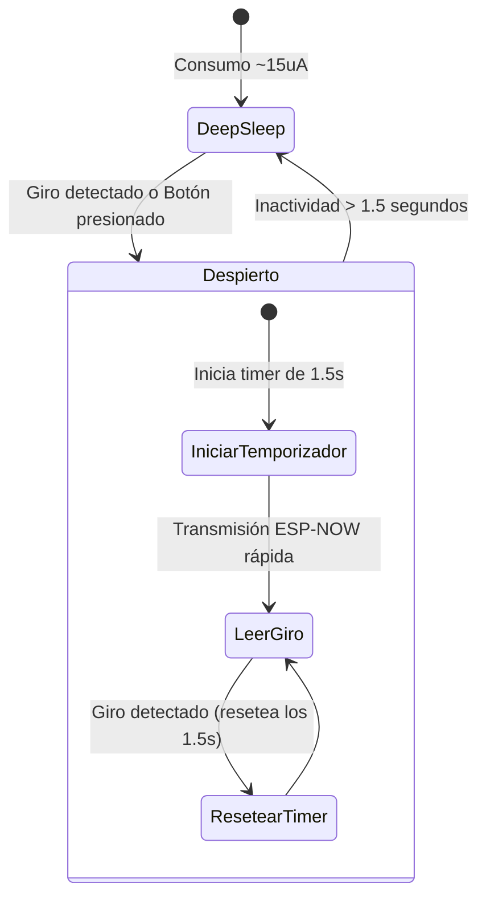

# Control de Atenuación con Encoder Rotativo Inalámbrico

Este documento evalúa la viabilidad y detalla la implementación de un **Encoder Rotativo (ej. modelo EC11)** como interfaz inalámbrica de control para la atenuación de las luces de la van.

---

## 1. Viabilidad y Ventajas del Encoder Rotativo

¡Sí, es totalmente posible y es una de las mejores interfaces para atenuar luces! Un encoder rotativo (que incluye giro infinito hacia ambos lados y un botón pulsador al presionar el eje) ofrece una experiencia de usuario premium:

*   **Precisión táctil:** Puedes ajustar el brillo exacto girando la perilla (sientes los pequeños "pasos" mecánicos).
*   **Interfaz multifunción:** 
    *   **Giro:** Regula el brillo (Brillo++ / Brillo--).
    *   **Click simple:** Enciende / Apaga la luz.
    *   **Doble click / Click largo:** Puede cambiar de zona. Por ejemplo, **una sola perilla física** podría controlar las 4 zonas de luces si usas el click para alternar entre ellas (Zona 1 $\rightarrow$ Zona 2 $\rightarrow$ etc.).

---

## 2. El Desafío del Consumo de Batería (Deep Sleep)

En un pulsador simple, el ESP32 despierta, envía un mensaje y se duerme inmediatamente. Con un encoder rotativo, si el usuario gira la perilla rápidamente, el ESP32 no puede entrar y salir de Deep Sleep en cada "clic" del giro, ya que el arranque del chip toma unos 50-80 ms y la comunicación se sentiría con mucho retraso (lag).

### La Solución: Temporizador de Actividad (Inactivity Timeout)

Para que el control se sienta instantáneo y suave, implementamos una lógica de **"Despierto bajo Demanda"**:



1.  **Despertar:** El ESP32 C6 está en Deep Sleep. Al girar la perilla o presionar el botón, se genera una interrupción física que despierta al chip en menos de 50 ms.
2.  **Modo Activo Temporal:** Una vez despierto, el ESP32 inicializa la radio y **se mantiene encendido** ejecutando un temporizador de inactividad de **1.5 segundos**.
3.  **Transmisión Fluida:** Mientras el usuario siga girando la perilla, el temporizador se reinicia constantemente. El ESP32 transmite cada paso de giro de forma inmediata y en tiempo real por ESP-NOW. El cambio de brillo se siente instantáneo y fluido.
4.  **Retorno a Sleep:** Al dejar de interactuar por más de 1.5 segundos, el ESP32 C6 vuelve a Deep Sleep para conservar la batería.

---

## 3. Diagrama de Conexión del Prototipo (XIAO ESP32-C6 + EC11)

Un encoder rotativo estándar (como el EC11) tiene 5 pines: 3 para el encoder (A, B, Común) y 2 para el botón pulsador (Switch, Común).

```
   [ Encoder Rotativo EC11 ]
     /    |    \      |    \
    A    GND    B    SW    GND
    |     |     |     |     |
   D0    GND   D1    D2    GND  <-- Pines en el XIAO ESP32-C6
```

*   **Pines A y B (Encoder):** Conectados a `D0` (GPIO 0) y `D1` (GPIO 1). Ambos pines son LP-GPIO (Low Power) capaces de despertar al chip.
*   **Pin SW (Switch/Botón):** Conectado a `D2` (GPIO 2). También es un pin capaz de despertar al chip.
*   **Comunes:** Conectados a `GND`.
*   *Nota:* Se deben usar resistencias de pull-up de 10k Ohm externas hacia los 3V3 de la batería en las líneas A, B y SW para evitar lecturas falsas y asegurar un correcto despertar del Deep Sleep.

---

## 4. Estructura de Mensaje Modificada para Encoders

Para soportar el encoder, la estructura de mensaje se adaptaría para enviar incrementos relativos en lugar de comandos absolutos:

```cpp
struct __attribute__((packed)) EncoderMessage {
    uint8_t remote_id;      // ID del control
    int8_t rotation_steps;  // Pasos de giro (ej. +2, -1, 0)
    uint8_t button_event;   // 0 = Ninguno, 1 = Click, 2 = Doble Click
    float battery_voltage;  // Monitoreo de batería
};
```

*   Si `rotation_steps` es **positivo**, el central incrementa el ciclo PWM de la zona activa.
*   Si `rotation_steps` es **negativo**, decrementa el ciclo PWM.
*   Si `button_event == 1`, enciende/apaga la zona activa.
