# Estimación de Complejidad y Tiempos del Proyecto

Este documento evalúa de forma realista la complejidad de cada fase del proyecto (desde el prototipado hasta la instalación final en la van) y estima el tiempo necesario para completarlo, considerando tanto las horas de trabajo activo como los tiempos de espera de fabricación y envíos.

---

## 1. Desglose del Proyecto por Fases

El proyecto se divide en 4 fases lógicas:

```mermaid
gantt
    title Cronograma Estimado del Proyecto (Semanas)
    dateFormat  X
    axisFormat %d
    
    section Fase 1: Prototipado
    Adquisición de Componentes :active, 0, 7
    Pruebas en Protoboard y Firmware :active, 5, 14
    
    section Fase 2: Diseño PCB
    Esquemático en Atopile : 12, 19
    Ruteado (Layout) en KiCad : 19, 28
    
    section Fase 3: Fabricación
    Envío a Fábrica y Espera (Gerber) : 28, 42
    Ensamblaje y Soldadura : 42, 47
    
    section Fase 4: Instalación
    Diseño/Impresión de Carcasas 3D : 45, 50
    Cableado e Integración Física : 49, 56
```

---

## 2. Evaluación de Complejidad y Tiempos por Fase

### Fase 1: Prototipado y Validación de Firmware
*   **Tareas:** Comprar los componentes de prueba, armar el circuito en protoboard, validar la comunicación ESP-NOW entre el XIAO C6 central y el remoto, medir consumos de Deep Sleep y probar la lógica de pulsación corta/larga o del encoder.
*   **Complejidad:** **Baja-Media** (El código base ya está escrito y estructurado; el reto es el debugeo inicial).
*   **Tiempo de trabajo activo:** 6 a 10 horas.
*   **Tiempo de calendario:** **1 a 2 semanas** (dependiendo del envío de los componentes).

### Fase 2: Diseño de Hardware (Esquemático y PCB)
*   **Tareas:** Diseñar el circuito definitivo usando Atopile (MCU central, regulador de 12V a 5V/3.3V, chip expansor PCA9685, drivers PROFET de potencia, optoacopladores, fusibles y borneras). Realizar el ruteado físico de las pistas de potencia (layout) en KiCad pcbnew.
*   **Complejidad:** **Media-Alta** (El diseño lógico en Atopile es sencillo con mi asistencia, pero el ruteado en KiCad requiere cuidado: las pistas de potencia de 12V que manejan hasta 10A deben ser muy anchas y tener planos de cobre adecuados para evitar calentamiento).
*   **Tiempo de trabajo activo:** 12 a 20 horas.
*   **Tiempo de calendario:** **2 a 3 semanas**.

### Fase 3: Fabricación y Ensamblaje de la Placa
*   **Tareas:** Generar archivos Gerber, enviarlos a fabricar (ej. JLCPCB o PCBWay), adquirir los componentes SMD finales y soldar la placa central y el remoto.
*   **Complejidad:** **Alta** (si sueldas componentes SMD muy pequeños a mano con cautín) o **Baja** (si decides encargar el ensamblaje de componentes SMD directamente a la fábrica de PCBs y tú solo sueldas las borneras y conectores grandes).
*   **Tiempo de trabajo activo:** 3 a 5 horas (soldadura básica).
*   **Tiempo de calendario:** **2 a 3 semanas** (principalmente tiempo de fabricación y envío internacional desde China).

### Fase 4: Integración Física e Instalación en la Van
*   **Tareas:** Diseñar e imprimir en 3D las carcasas (enclosures) para la central y los remotos. Montar físicamente la central en el gabinete eléctrico, pasar los cables de potencia de 12V hacia las luces/bomba/ventilador, conectar los cables de señal al inversor Multiplus II y montar los remotos en las paredes.
*   **Complejidad:** **Media** (Es trabajo de electricidad y carpintería camper: pasar cables, crimpar terminales de ojo/espada de forma segura y fijar cajas).
*   **Tiempo de trabajo activo:** 8 a 15 horas.
*   **Tiempo de calendario:** **1 a 2 fines de semana**.

---

## 3. Resumen de Esfuerzo Total

*   **Horas de Trabajo Real (Esfuerzo Activo):** **~30 a 50 horas** distribuidas en tus ratos libres (tardes y fines de semana).
*   **Tiempo de Calendario Estimado:** **6 a 10 semanas** (del inicio al fin del proyecto, respetando los tiempos muertos de envíos y fabricación).

---

## 4. Factores que Pueden Acelerar o Retrasar el Proyecto

*   **¿Qué acelera el proyecto?**
    *   **Contratar Ensamblaje de Fábrica (SMT Assembly):** Mandar a fabricar la PCB con los componentes SMD (reguladores, transistores, PCA9685) ya soldados por la fábrica cuesta unos $15-$25 USD extra, pero ahorra horas de soldadura difícil y elimina casi todo el riesgo de cortocircuitos por fallas de soldadura humana.
    *   **Usar cajas de proyectos genéricas:** En lugar de diseñar e imprimir carcasas 3D a medida, usar cajas plásticas estándar de electricidad.
*   **¿Qué retrasa el proyecto?**
    *   **Errores en el diseño de la PCB:** Si erras una conexión en la PCB, tendrás que parchar la placa con cables (bodge wires) o mandar a fabricar una nueva versión (otra espera de 2 semanas). Realizaremos revisiones exhaustivas de diseño (DRC) para evitar esto.
