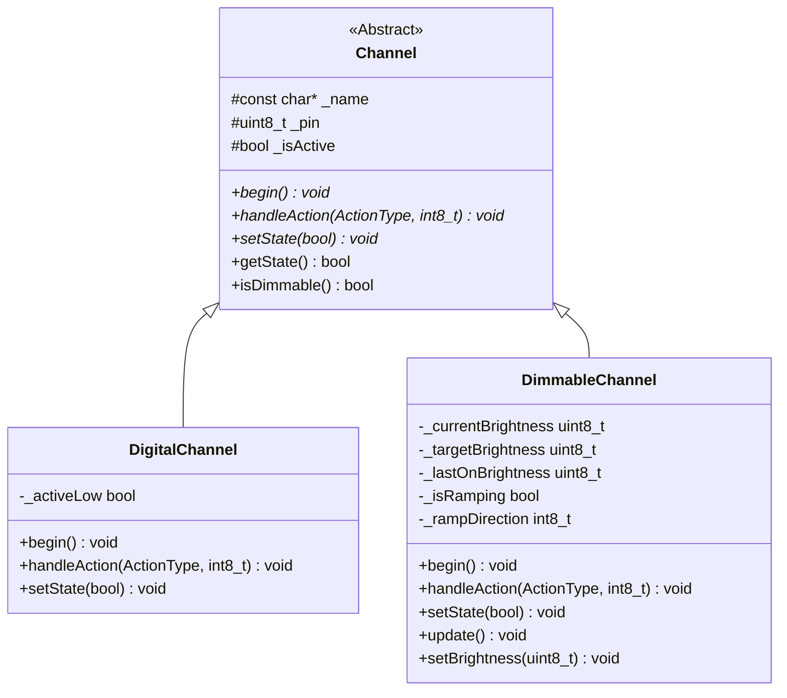
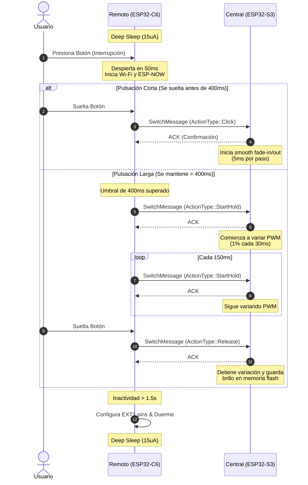
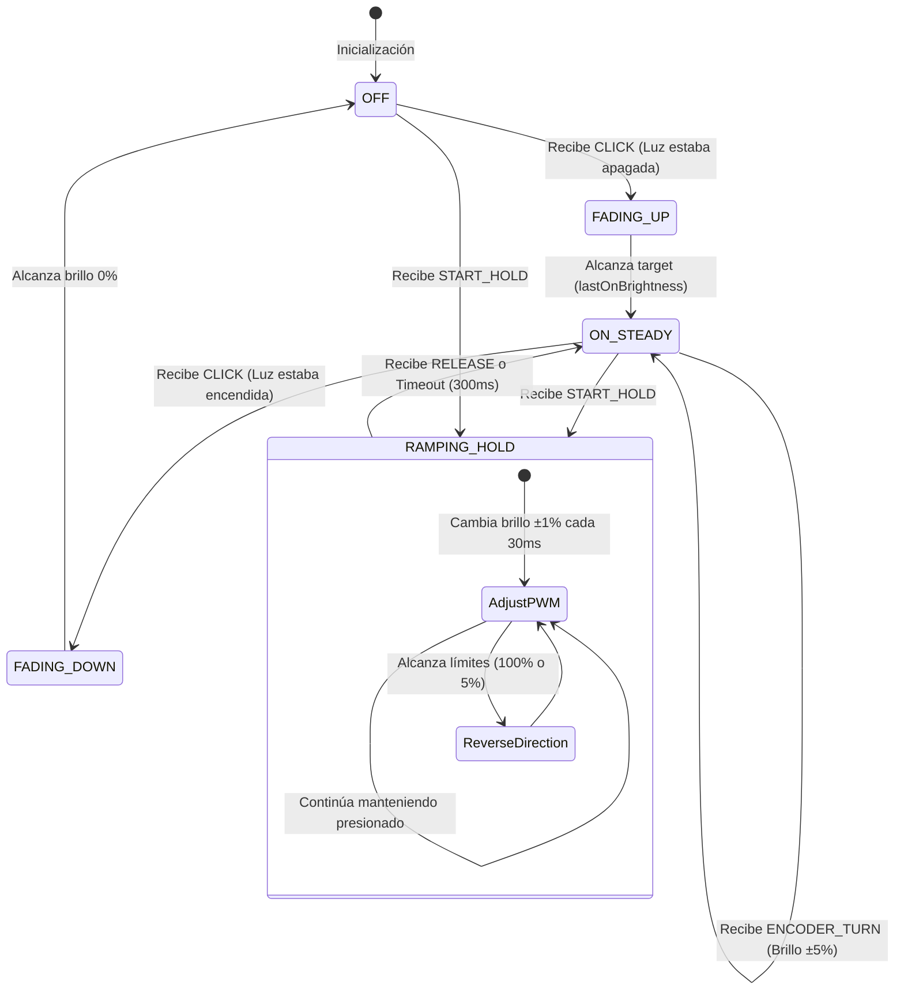

# VanNOW: Documentación Unificada del Firmware y Arquitectura

Este documento proporciona una especificación técnica unificada del sistema **VanNOW** (Sistema de Relés Inalámbricos para Camper Van). Compila la filosofía de diseño, especificaciones de hardware, restricciones de seguridad física e inalámbrica, y la arquitectura de software detallada del firmware central y remoto.

---

## 1. Introducción y Filosofía de Diseño

El sistema **VanNOW** centraliza el control de potencia en el gabinete eléctrico de una camper van, eliminando la necesidad de pasar cables de control pesados hacia múltiples interruptores físicos en las paredes. En su lugar, utiliza comunicación inalámbrica directa de corto alcance.

```mermaid
graph TD
    %% Módulos Remotos
    subgraph Modulos Remotos (Inalámbricos - Batería 2x AA)
        R1["[Panel Entrada] (Pulsadores Físicos)"]
        R2["[Panel Cama] (Pulsadores Físicos / Encoder)"]
    end

    %% Gabinete Eléctrico
    subgraph Gabinete Central (12V Batería Van)
        Buck["Regulador Buck (12V -> 5V/3.3V)"]
        MCU_C["ESP32-S3 Central"]
        Power_Stage["Etapa de Potencia: MOSFETs / PROFETs"]
        Override["Bypass Físico (ON-OFF-AUTO)"]
        Fuses["Caja de Fusibles"]

        Buck --> MCU_C
        MCU_C -->|Señal de Control 3.3V| Power_Stage
        Power_Stage --> Override
        Override --> Fuses
    end

    %% Cargas 12V
    subgraph Cargas Controladas (12V DC)
        L1["Luces LED (Zonas 1-4)"]
        Pump["Bomba de Agua"]
        Aux["Salidas Auxiliares (1-3)"]
        Fan["Ventilador de Techo"]
        Inverter["Inversor (Multiplus II)"]
        DCDC["Cargador DC-DC"]
    end

    %% Conexiones
    R1 -->|ESP-NOW 2.4 GHz| MCU_C
    R2 -->|ESP-NOW 2.4 GHz| MCU_C

    Fuses --> L1
    Fuses --> Pump
    Fuses --> Aux
    Fuses --> Fan
    Fuses --> Inverter
    Fuses --> DCDC
```

### 1.1. Comparativa de Eficiencia Energética: Standby

Uno de los pilares del diseño es la eficiencia energética extrema. A diferencia de las soluciones basadas en servidores (como Home Assistant o VanPi en una Raspberry Pi), VanNOW minimiza las corrientes de reposo para evitar la descarga de la batería de servicio cuando la van está parada.

| Métrica                       | Propuesta VanNOW (Punto a Punto) | Sistema Servidor (Pi + Router + ESPHome) |
| :---------------------------- | :------------------------------- | :--------------------------------------- |
| **Potencia en Standby**       | **0.15 W**                       | ~10 W a 15 W                             |
| **Consumo Diario (a 12V)**    | **~0.25 Ah / día**               | ~20 a 30 Ah / día                        |
| **Autonomía (Batería 100Ah)** | **400 días** (Más de 1 año)      | **5 días** (Requiere apagado total)      |
| **Dependencia de Red**        | **Ninguna** (ESP-NOW autónomo)   | Alta (Requiere Router Wi-Fi encendido)   |

---

## 2. Restricciones de Hardware y Seguridad Física

La seguridad eléctrica y la resiliencia mecánica ante vibraciones de la carretera son críticas en un entorno vehicular. El diseño incorpora las siguientes restricciones obligatorias:

### 2.1. Conmutación por Lado de Alta (High-Side Switching)

> [!IMPORTANT]
> Para sistemas eléctricos de 12V en chasis metálicos (vans), se debe conmutar siempre la línea positiva (High-Side) y mantener el retorno a masa (GND) directo. Esto evita que un cable pelado que toque la chapa metálica provoque una activación involuntaria del dispositivo.

### 2.2. Protección de Cargas Críticas e Inductivas

- **Bomba de Agua (Carga Inductiva):** Motores como el de la bomba Seaflo generan picos inductivos de retorno (fuerza contraelectromotriz) al apagarse que pueden quemar los transistores de control. Es **obligatorio** colocar un diodo de retorno flyback (ej. **1N5408**) en paralelo con la bomba (ánodo a tierra, cátodo a positivo) y proteger la línea con un fusible de 15A.
- **Calefactor Diésel:** El calefactor requiere alimentación permanente de 12V para permitir que su placa interna controle el ciclo de enfriamiento (el apagado abrupto de energía fundiría el plástico interno). Su control se realiza de forma lógica mediante un optoacoplador [PC817](analisis_critico_riesgos.md#L16) puenteando los terminales de señal de su pantalla/termostato.
- **Nevera de 12V (Compresor):** Para evitar los picos de arranque de 10A y la fatiga electrónica, la nevera se alimenta de forma constante. La activación/desactivación se realiza puenteando lógicamente los pines del termostato (**`T`** y **`C`** en compresores Secop/Danfoss) usando un optoacoplador [PC817](analisis_critico_riesgos.md#L17).

### 2.3. Redundancia Mecánica (Bypass ON-OFF-AUTO)

Para evitar el "efecto caja negra" y asegurar el control si el microcontrolador o el firmware fallan en viaje:

- Se instalan interruptores manuales SPDT (ON-OFF-ON) de 3 posiciones para cargas críticas.
- **AUTO:** El circuito es controlado lógicamente por el ESP32.
- **OFF:** Aislamiento físico total de la carga (útil si un MOSFET falla cortocircuitado).
- **ON (Bypass):** Conexión directa a la batería de 12V.
- > [!WARNING]
  > Estos interruptores **no deben soldarse en la PCB** para evitar que las vibraciones de la carretera agrieten las soldaduras. Se montan en el panel frontal del gabinete y se conectan mediante terminales de presión/crimpado **Faston**.

### 2.4. Descarte de Radiofrecuencia Insegura (433 MHz)

Se evaluó el uso de transceptores CC1101 de 433 MHz con interruptores comerciales estáticos (ASK/OOK).

> [!CAUTION]
> Se descartan oficialmente los mandos de 433 MHz estáticos debido a la falta de cifrado. Cualquier dispositivo de clonación (como un Flipper Zero) podría capturar y repetir las señales, encendiendo de forma no deseada cargas críticas como la bomba de agua (riesgo de inundación o bomba funcionando en seco hasta quemarse) o el inversor (descarga de baterías).

---

## 3. Selección y Conectividad de Microcontroladores

```
   [ Seeed Studio XIAO ESP32-C6 ]           [ Lonely Binary ESP32-S3 ]
       (Remoto / Pulsadores)                    (Central Cabinet)
       Consumo Sleep: ~15 uA                   Flash: 16MB | PSRAM: 8MB
          (Wi-Fi 6 / 2.4G)   ==== ESP-NOW ====>      (Wi-Fi 4 / 2.4G)
```

1.  **Módulo Remoto: Seeed Studio XIAO ESP32-C6**
    - **Razón:** Arquitectura RISC-V mononúcleo de bajo consumo (~15 $\mu$A en Deep Sleep) y formato ultracompacto (17.5 x 21 mm) para caber detrás de placas de pared.
    - **Conectividad:** Soporta Wi-Fi 6, que baja automáticamente a modo 802.11b/g/n para comunicarse con la central.
2.  **Módulo Central: Lonely Binary ESP32-S3 N16R8**
    - **Razón:** Cuenta con más de 40 GPIOs (evitando el ruteado de multiplexores I2C adicionales), acabado de oro por inmersión de alta fiabilidad, y amplia memoria (16MB Flash, 8MB PSRAM). Su consumo de ~90 mA en escucha continua equivale a 0.66 Ah/día a 12V, despreciable para baterías camper.

---

## 4. Estructura y Funcionamiento del Firmware

El firmware está dividido en módulos PlatformIO bajo la carpeta [`firmware/`](../firmware).

### 4.1. Protocolo Común (`lib/protocol`)

Define la estructura compacta y optimizada de datos que viaja sobre las tramas inalámbricas.

- [protocol.h](../firmware/lib/protocol/protocol.h): Contiene el enum [ActionType](../firmware/lib/protocol/protocol.h#L7-L12) y la estructura alineada [SwitchMessage](../firmware/lib/protocol/protocol.h#L15-L21):

```cpp
enum class ActionType : uint8_t {
    Click = 0,      // Pulsación corta (Toggle ON/OFF)
    StartHold = 1,  // Pulsación larga iniciada
    Release = 2,    // Pulsación larga liberada
    EncoderTurn = 3 // Giro de encoder rotativo
};

struct __attribute__((packed)) SwitchMessage {
    uint8_t remote_id;       // ID del panel remoto (ej. 1 = Entrada, 2 = Cama)
    uint8_t button_index;    // Índice del botón o encoder (0 a 3)
    uint8_t action;          // ActionType casted a uint8_t
    int8_t rotation_steps;   // Pasos de giro del encoder (+x / -x)
    float battery_voltage;   // Nivel de tensión de la batería del remoto
};
```

- [WirelessManager](../firmware/lib/wireless/src/WirelessManager.h): Encapsula la lógica de inicialización de la pila Wi-Fi en modo Estación (WIFI_STA) apagando la conexión de red ordinaria, el registro de peers para ESP-NOW, y el envío/recepción de payloads binarios.

---

### 4.2. Módulo Central (`firmware/central`)

El nodo receptor ejecuta una arquitectura orientada a objetos para abstraer los pines de control.



#### Clases del Central

1.  **[Channel](../firmware/central/src/Channel.h):** Interfaz base abstracta que gestiona propiedades como el nombre, pin físico y estado activo.
2.  **[DigitalChannel](../firmware/central/src/DigitalChannel.h):** Controla salidas ON/OFF estándar (relés, PROFETs, optoacopladores). Implementa una lógica simple de conmutación (Toggle) al recibir un evento de `ActionType::Click`.
3.  **[DimmableChannel](../firmware/central/src/DimmableChannel.h):** Controla la iluminación LED por modulación de ancho de pulso (PWM) mediante el periférico `LEDC` del ESP32. Soporta:
    - **Smooth Click Fading:** Al hacer click, la iluminación no se enciende de golpe; realiza una rampa gradual (fade) hacia el estado objetivo a un intervalo de **5 ms por paso de brillo**.
    - **Continuous Hold Ramping:** Al iniciar un Hold (`StartHold`), incrementa o decrementa continuamente el brillo en **1% cada 30 ms**. Si el usuario alcanza los límites (100% o 5%), el sentido de la rampa se invierte automáticamente.
    - **Hold Safety Timeout:** Si no recibe mensajes periódicos de Hold en **300 ms**, detiene automáticamente la rampa para evitar desbordamientos de brillo si se corta la comunicación inalámbrica.
    - **Memoria de Brillo:** Recuerda el último nivel de brillo configurado para que al hacer click de encendido regrese a ese nivel.
    - **Encoder Turn Adjust:** Ajusta de forma relativa el brillo en pasos de **±5% por cada click del codificador**.
4.  **[SystemController](../firmware/central/src/SystemController.h):** Coordina los 11 canales de la van y mapea los mensajes de los paneles remotos a sus salidas correspondientes:

| Pin ESP32-S3 | Canal Físico                  | Tipo de Canal  | Mapeo de Remotos           |
| :----------: | :---------------------------- | :------------: | :------------------------- |
| **GPIO 12**  | Lights Zone 1 (Luces Entrada) |    Dimmable    | Panel 1 (Entrada), Botón 0 |
| **GPIO 13**  | Lights Zone 2 (Luces Cocina)  |    Dimmable    | Panel 1 (Entrada), Botón 1 |
| **GPIO 14**  | Lights Zone 3 (Luces Cama)    |    Dimmable    | Panel 2 (Cama), Botón 0    |
| **GPIO 27**  | Lights Zone 4 (Luces Baño)    |    Dimmable    | Panel 2 (Cama), Botón 1    |
| **GPIO 25**  | Water Pump (Bomba Seaflo)     |    Digital     | Panel 1 (Entrada), Botón 2 |
| **GPIO 26**  | Aux Outlet 1                  |    Digital     | -                          |
| **GPIO 32**  | Aux Outlet 2                  |    Digital     | -                          |
| **GPIO 33**  | Aux Outlet 3                  |    Digital     | -                          |
| **GPIO 19**  | Ceiling Fan (Ventilador)      |    Digital     | Panel 2 (Cama), Botón 2    |
| **GPIO 21**  | Inverter (Multiplus II)       | Digital (Opto) | Panel 1 (Entrada), Botón 3 |
| **GPIO 22**  | DC-DC Charger                 | Digital (Opto) | -                          |

> [!NOTE]
> El botón 3 del Panel 2 (Cama) está mapeado para ejecutar una función de seguridad global: apagar simultáneamente todas las zonas de luces regulables (canales 0 a 3).

- **Monitoreo de Batería de Cabina:** La clase [SystemController](../firmware/central/src/SystemController.cpp#L95-L100) lee el voltaje de la batería de servicio utilizando un pin analógico (**GPIO 1**) conectado a un divisor resistivo de tensión (**100kΩ** de pull-up y **27kΩ** de pull-down). La fórmula aplicada es:
  $$V_{\text{bat}} = V_{\text{adc}} \times \frac{100\text{k} + 27\text{k}}{27\text{k}}$$
  Donde la tensión de referencia del ADC está calibrada a **3.1V**.

---

### 4.3. Módulo Remoto (`firmware/remote`)

El firmware del remoto está diseñado con el fin exclusivo de ahorrar energía, procesar entradas físicas y apagar el microcontrolador.

#### Secuencias de Operación del Remoto

- **Evitar Descarga en Arranque en Frío:** Al arrancar por primera vez (conexión de baterías), el firmware verifica la causa del inicio (`esp_sleep_get_wakeup_cause()`). Si no es una interrupción física externa (`ESP_SLEEP_WAKEUP_EXT1`), el microcontrolador entra de inmediato en Deep Sleep sin encender la radio Wi-Fi, asegurando un consumo nulo antes del primer uso.
- **Despierto bajo Demanda (Inactivity Timeout):** Al presionar un botón o girar el codificador, la interrupción despierta al chip en menos de 50 ms. El sistema inicializa la radio y arranca un contador de inactividad de **1500 ms**. Cada evento físico posterior recarga este temporizador. Si transcurre 1.5 segundos sin actividad, el chip se duerme para conservar la batería.

#### Clases del Remoto

1.  **[PowerManager](../firmware/remote/src/PowerManager.h):** Controla el temporizador de inactividad activa y configura el despertar en Deep Sleep mediante el registro `EXT1` de Espressif, asociándolo a una máscara de pines configurados en flanco de bajada (LOW).
2.  **[ButtonHandler](../firmware/remote/src/ButtonHandler.h):** Implementa una máquina de estados finitos (FSM) para debouncing por software (15 ms) y discriminación de pulsaciones:
    - **Pulsación Corta (Click):** Se libera el botón antes de **400 ms**.
    - **Pulsación Larga (Hold):** Si el botón se mantiene presionado más de **400 ms**, envía un mensaje de `StartHold` y emite repeticiones continuas del comando cada **150 ms** para mantener informada a la central. Al soltarlo, envía el mensaje `Release`.
3.  **[EncoderHandler](../firmware/remote/src/EncoderHandler.h):** Decodifica transiciones de código Gray de encoders rotativos (ej. EC11) monitoreando los pines A y B (conectados a pines de interrupción LP-GPIO `D0` y `D1`), y el pulsador integrado en el eje (pin `D2`).
4.  **[RemoteSender](../firmware/remote/src/RemoteSender.h):** Encapsula el envío de mensajes y telemetría de batería por ESP-NOW. Centraliza la inicialización de la pila de red, el registro del callback de estado de envío y el peer receptor, controlando también la espera y validación del ACK de entrega del paquete.

#### Telemetría de Batería del Remoto

El remoto mide su propia tensión de alimentación (baterías AA) mediante un divisor resistivo simétrico de **100kΩ / 100kΩ** conectado a la entrada analógica **GPIO 4 (D4)**. El valor medido se adjunta en cada mensaje de transmisión (`battery_voltage`). Si la tensión reportada desciende de **2.2V**, el receptor central emite una alerta por puerto serie indicando la necesidad de cambiar las baterías del panel respectivo.

---

## 5. Diagramas de Flujo y Secuencias

### 5.1. Secuencia de Comunicación Inalámbrica (Click vs. Hold)



### 5.2. Máquina de Estados del DimmableChannel (Central)



---

## 6. Configuración del Entorno de Compilación y Test

El proyecto utiliza **PlatformIO** para compilar y cargar el firmware.

### 6.1. Definiciones de Entorno ([platformio.ini](../firmware/central/platformio.ini))

- `seeed_xiao_esp32c6`: Entorno de producción del panel remoto, usando la URL estable de la plataforma pioarduino para habilitar el soporte completo del SDK de ESP32-C6.
- `esp32-s3-devkitc-1`: Entorno de producción del gabinete central, mapeando los pines hacia el microcontrolador ESP32-S3.
- `native`: Entorno de pruebas unitarias locales (compilación nativa en host x86_64/ARM64). Excluye los componentes de hardware reales e incluye el framework de mock de Arduino ([arduino_mock](../firmware/lib/arduino_mock/src/Arduino.h)).

### 6.2. Ejecución de Tests Unitarios

Para validar los algoritmos de filtrado, Gray code, máquinas de estado de botones y rampas de brillo en local sin hardware conectado:

1.  Navega al directorio central o remoto:
    ```bash
    cd firmware/central   # o cd firmware/remote
    ```
2.  Ejecuta el comando de test nativo de PlatformIO:
    ```bash
    pio test -e native
    ```
