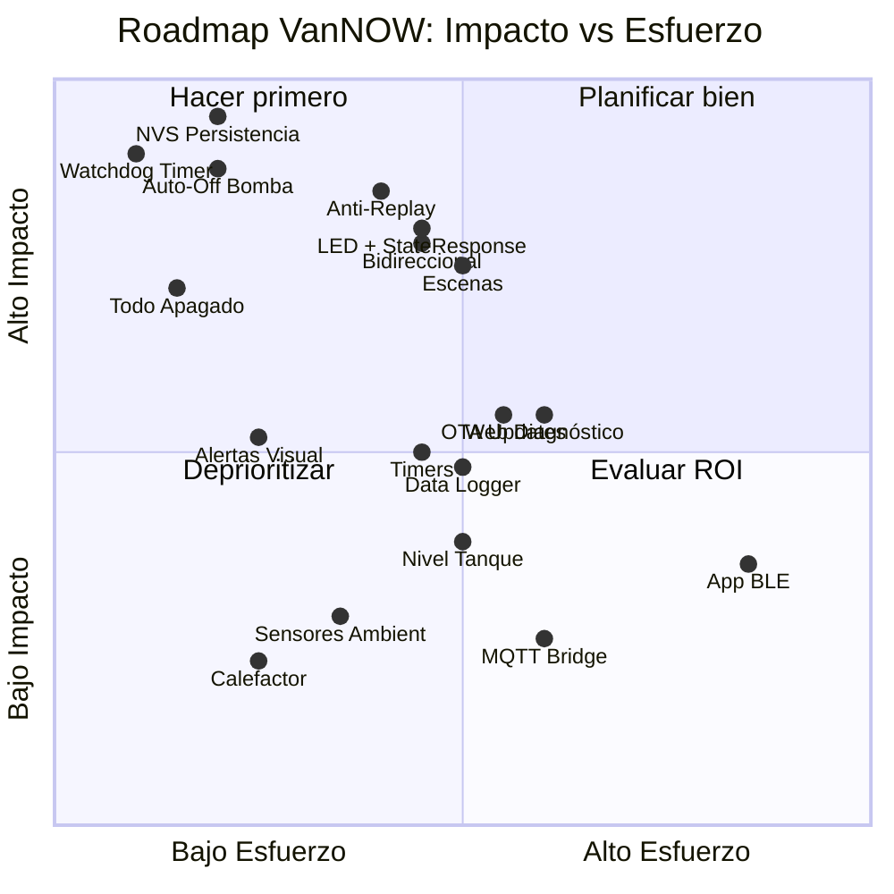
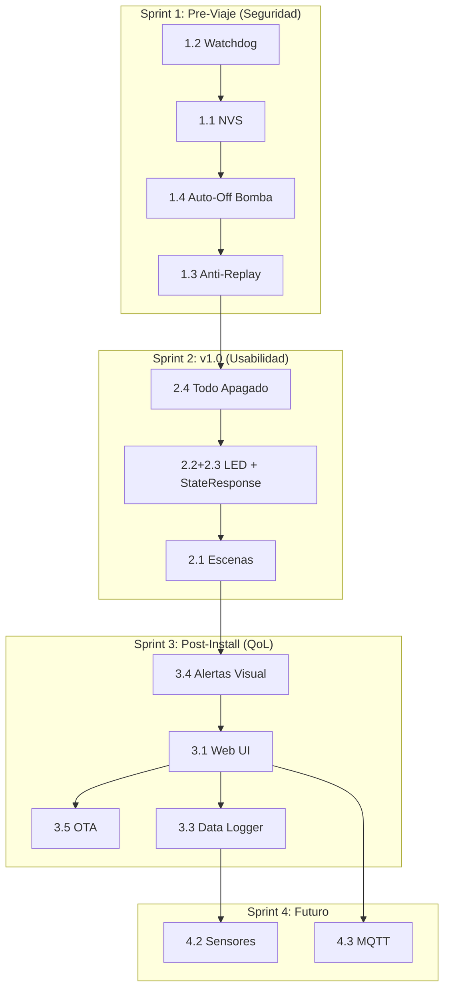

# VanNOW — Product Roadmap

> Roadmap de funcionalidades priorizadas por **impacto real en la vida diaria** dentro de la van y **utilidad práctica** del sistema. Cada feature está evaluada contra el estado actual del código y la arquitectura existente.

---

## Estado Actual del Producto

El sistema VanNOW hoy tiene:

- ✅ Comunicación ESP-NOW funcional (Central ↔ Remotos)
- ✅ 11 canales de control (4 dimmable + 7 digital)
- ✅ Deep Sleep en remotos (~15μA, >2 años con 2x AA)
- ✅ Dimming suave por PWM con fade-in/out y hold-ramp
- ✅ Telemetría de batería en remotos y central
- ✅ Mapeo de paneles a canales en [`SystemController`](../firmware/central/src/SystemController.cpp)
- ✅ Tests unitarios nativos para channels y handlers
- ✅ Diseño PCB en Atopile ([`central.ato`](../hardware/central_pcb/central.ato))
- ⬜ Sin persistencia de estado (se pierde al reiniciar)
- ⬜ Sin feedback visual al usuario en los remotos
- ⬜ Sin interfaz de diagnóstico/configuración
- ⬜ Sin protección contra replay en ESP-NOW

---

## 🔴 Tier 1 — Impacto Crítico (Seguridad y Fiabilidad)

> Funcionalidades que previenen pérdida de datos, daño al hardware o situaciones peligrosas. **Implementar antes del primer viaje.**

### 1.1. Persistencia de Estado en NVS (Non-Volatile Storage)

| Aspecto                | Detalle                                                                                                                                                                                                          |
| :--------------------- | :--------------------------------------------------------------------------------------------------------------------------------------------------------------------------------------------------------------- |
| **Problema**           | Si el ESP32-S3 central se reinicia (brownout, bug, etc.), todos los canales arrancan apagados. Las luces y la bomba pierden su estado anterior.                                                                  |
| **Solución**           | Guardar el estado de cada canal y el brillo de los `DimmableChannel` en la partición NVS del ESP32. Restaurar al boot.                                                                                           |
| **Impacto**            | 🔴 Crítico — Evita que un reinicio inesperado deje la van a oscuras o con la bomba apagada en pleno uso.                                                                                                         |
| **Esfuerzo**           | 🟢 Bajo (~2-4h). La API `Preferences.h` de Arduino-ESP32 es trivial.                                                                                                                                             |
| **Archivos afectados** | [`DimmableChannel.cpp`](../firmware/central/src/DimmableChannel.cpp), [`DigitalChannel.cpp`](../firmware/central/src/DigitalChannel.cpp), [`SystemController.cpp`](../firmware/central/src/SystemController.cpp) |

---

### 1.2. Watchdog Timer (WDT) en la Central

| Aspecto                | Detalle                                                                                                                                |
| :--------------------- | :------------------------------------------------------------------------------------------------------------------------------------- |
| **Problema**           | Si el firmware de la central se cuelga (deadlock, excepción no capturada), el sistema deja de responder a los remotos indefinidamente. |
| **Solución**           | Activar el Task Watchdog Timer de ESP-IDF (~10s). Si `loop()` deja de ejecutarse, el WDT reinicia automáticamente el chip.             |
| **Impacto**            | 🔴 Crítico — Autorecuperación ante crashes sin intervención del usuario.                                                               |
| **Esfuerzo**           | 🟢 Bajo (~1-2h). Llamada a `esp_task_wdt_init()` y `esp_task_wdt_reset()` en el loop.                                                  |
| **Archivos afectados** | [`main.cpp` (central)](../firmware/central/src/main.cpp)                                                                               |

---

### 1.3. Autenticación de Mensajes ESP-NOW (Anti-Replay)

| Aspecto                | Detalle                                                                                                                                                                                                                                                              |
| :--------------------- | :------------------------------------------------------------------------------------------------------------------------------------------------------------------------------------------------------------------------------------------------------------------- |
| **Problema**           | Aunque ESP-NOW es más seguro que 433 MHz, un atacante con un sniffer Wi-Fi podría capturar y re-transmitir un paquete `SwitchMessage` sin modificarlo (replay attack).                                                                                               |
| **Solución**           | Agregar un campo `sequence_number` monotónico creciente al [`SwitchMessage`](../firmware/lib/protocol/protocol.h). La central rechaza mensajes con sequence ≤ al último recibido por ese `remote_id`. Opcionalmente, habilitar el cifrado PMK/LMK nativo de ESP-NOW. |
| **Impacto**            | 🔴 Crítico para seguridad — Previene activación remota no autorizada de bomba de agua o inversor.                                                                                                                                                                    |
| **Esfuerzo**           | 🟡 Medio (~4-6h). Requiere actualizar el protocolo en ambos firmwares.                                                                                                                                                                                               |
| **Archivos afectados** | [`protocol.h`](../firmware/lib/protocol/protocol.h), [`RemoteSender.cpp`](../firmware/remote/src/RemoteSender.cpp), [`SystemController.cpp`](../firmware/central/src/SystemController.cpp)                                                                           |

---

### 1.4. Protección contra Inundación de Bomba de Agua (Auto-Off Timer)

| Aspecto                | Detalle                                                                                                                                                                             |
| :--------------------- | :---------------------------------------------------------------------------------------------------------------------------------------------------------------------------------- |
| **Problema**           | Si alguien enciende la bomba de agua y se olvida (o un replay attack la activa), puede correr indefinidamente, vaciando el tanque o quemándose si funciona en seco.                 |
| **Solución**           | Implementar un auto-off configurable en `DigitalChannel` para cargas críticas. La bomba se apaga automáticamente después de N minutos (ej. 10 min) y requiere re-activación manual. |
| **Impacto**            | 🔴 Crítico — Previene daño físico al equipo y desperdicio de agua.                                                                                                                  |
| **Esfuerzo**           | 🟢 Bajo (~2-3h). Timer simple en la clase `DigitalChannel`.                                                                                                                         |
| **Archivos afectados** | [`DigitalChannel.h`](../firmware/central/src/DigitalChannel.h), [`DigitalChannel.cpp`](../firmware/central/src/DigitalChannel.cpp)                                                  |

---

## 🟠 Tier 2 — Impacto Alto (Usabilidad Diaria)

> Funcionalidades que mejoran significativamente la experiencia de uso cotidiano. **Implementar para la versión 1.0 de producción.**

### 2.1. Escenas y Macros de Iluminación

| Aspecto         | Detalle                                                                                                                                                                                              |
| :-------------- | :--------------------------------------------------------------------------------------------------------------------------------------------------------------------------------------------------- |
| **Problema**    | No hay forma de activar combinaciones de luces predefinidas. Cada noche hay que ajustar 4 zonas manualmente.                                                                                         |
| **Solución**    | Definir "escenas" en la central (ej. "Noche" = Zona 3 al 15%, resto apagado; "Cocinar" = Zona 2 al 100%, Zona 1 al 50%). Activar con doble-click o una combinación especial de botón en los remotos. |
| **Impacto**     | 🟠 Alto — Elimina fricción en la rutina diaria más repetida (ajustar luces).                                                                                                                         |
| **Esfuerzo**    | 🟡 Medio (~6-10h). Requiere un nuevo `SceneManager` y extender el protocolo para un `ActionType::DoubleClick`.                                                                                       |
| **Dependencia** | Requiere 1.1 (NVS) para persistir la configuración de escenas.                                                                                                                                       |

---

### 2.2. LED de Feedback en Remotos (Confirmación Visual + Estado Contextual)

| Aspecto                | Detalle                                                                                                                                                                                              |
| :--------------------- | :--------------------------------------------------------------------------------------------------------------------------------------------------------------------------------------------------- |
| **Problema**           | El usuario presiona un botón y no sabe si la central lo recibió, ni en qué estado quedó el canal, especialmente si la carga controlada está en otra habitación (ej. bomba bajo el suelo).            |
| **Solución**           | Agregar un **LED bicolor 3mm (verde/rojo)** a cada remoto con flash transitorio al interactuar. El LED muestra el resultado de la acción y vuelve a apagarse antes de que el MCU entre a Deep Sleep. |
| **Impacto**            | 🟠 Alto — Elimina la incertidumbre "¿funcionó?" que es la queja #1 de sistemas inalámbricos, sin sacrificar la autonomía de batería.                                                                 |
| **Esfuerzo**           | 🟡 Medio (~6-8h). Hardware: 2 pines GPIO + 1 LED bicolor. Firmware: lógica de flash en callback de `esp_now_send` + parseo del `StateResponse`.                                                      |
| **Archivos afectados** | [`RemoteSender.cpp`](../firmware/remote/src/RemoteSender.cpp), [`main.cpp` (remote)](../firmware/remote/src/main.cpp), [`protocol.h`](../firmware/lib/protocol/protocol.h)                           |

#### Secuencia de Flash Propuesta

```
Usuario presiona botón → MCU despierta → Envía SwitchMessage → Central responde StateResponse
  ├─ ACK exitoso + canal quedó ON  → Flash VERDE 200ms
  ├─ ACK exitoso + canal quedó OFF → Flash ROJO 200ms
  ├─ ACK fallido (sin respuesta)   → Doble flash ROJO 2×100ms
  └─ Batería remoto < 2.4V         → Triple parpadeo ÁMBAR 3×150ms (después del flash de estado)
MCU entra a Deep Sleep (LED apagado, 0 μA)
```

#### Análisis de Impacto en Batería del Remoto

> [!IMPORTANT]
> **Decisión de diseño crítica:** Se descarta el uso de LEDs de estado persistente (que indiquen continuamente si un canal está ON/OFF) porque son incompatibles con la arquitectura de Deep Sleep. Un LED persistente obligaría al MCU a permanecer activo (~35 mA), reduciendo la autonomía de >2 años a **~3 días**.

| Configuración                      | Corriente en sleep   | Autonomía (2× AA, 2500 mAh) |
| :--------------------------------- | :------------------- | :-------------------------- |
| Actual (sin LED)                   | 15 μA                | >2 años                     |
| **LED bicolor 3mm (flash-only)**   | **15 μA (idéntico)** | **>2 años**                 |
| ~~NeoPixel WS2812B sin corte VCC~~ | ~~1015 μA~~          | ~~102 días~~ ❌             |
| ~~LED persistente + MCU awake~~    | ~~37 mA~~            | ~~2.8 días~~ ❌             |

**Consumo extra por pulsación con LED bicolor:** 10 mA × 200ms = 0.00056 mAh → **<5% de incremento sobre el consumo por pulsación actual.** El LED se apaga completamente antes del Deep Sleep, por lo que no hay corriente de reposo adicional.

> [!CAUTION]
> **No usar NeoPixels (WS2812B) sin un MOSFET P-channel que corte su VCC antes del Deep Sleep.** El chip WS2812B consume ~1 mA en reposo incluso con el LED apagado, lo que reduciría la autonomía de >2 años a ~3 meses.

---

### 2.3. Bidireccionalidad: Estado Contextual vía StateResponse

| Aspecto         | Detalle                                                                                                                                                                                                                                                                                            |
| :-------------- | :------------------------------------------------------------------------------------------------------------------------------------------------------------------------------------------------------------------------------------------------------------------------------------------------- |
| **Problema**    | Los remotos no saben el estado actual de los canales. Si Panel 1 enciende la Zona 1, Panel 2 no sabe que ya está encendida.                                                                                                                                                                        |
| **Solución**    | Después de procesar un comando, la central responde con un `StateResponse` compacto (bitmask de 11 canales + 4 niveles de brillo). El remoto usa esta respuesta para determinar el **color del flash de confirmación** (verde = ON, rojo = OFF), no para mantener LEDs encendidos permanentemente. |
| **Impacto**     | 🟠 Alto — El usuario sabe instantáneamente el estado resultante de su acción. Misma UX que interruptores Aqara/IKEA TRÅDFRI, que tampoco muestran estado persistente.                                                                                                                              |
| **Esfuerzo**    | 🟡 Medio (~6-8h). Requiere un nuevo struct `StateResponse` en el protocolo y registro bidireccional de peers ESP-NOW. No requiere hardware adicional más allá del LED de 2.2.                                                                                                                      |
| **Dependencia** | Requiere 2.2 (LED bicolor) como salida visual.                                                                                                                                                                                                                                                     |
| **Batería**     | Impacto nulo — El `StateResponse` se recibe durante el wake activo existente (~200ms). No extiende el tiempo despierto.                                                                                                                                                                            |

#### Protocolo StateResponse

```cpp
struct __attribute__((packed)) StateResponse {
    uint16_t channel_states;    // Bitmask: bits 0-10 = ON/OFF de cada canal
    uint8_t brightness[4];      // Brillo actual de zonas dimmable 0-3 (0-255)
    float cabin_battery;        // Voltaje batería de cabina
}; // 11 bytes total
```

> [!NOTE]
> **Evolución futura (e-ink):** Si en el futuro se desea mostrar el estado persistente de los canales sin consumo en reposo, la única opción viable es un display **e-ink/e-paper** (retiene la imagen sin energía, 0 μA en reposo). Esto se consideraría un feature separado de Tier 4 dado el incremento en costo (~$8-12 por remoto) y complejidad (bus SPI + librería de display).

---

### 2.4. Modo "Todo Apagado" (Panic / Good Night)

| Aspecto      | Detalle                                                                                                                                                                                                                                                                                                 |
| :----------- | :------------------------------------------------------------------------------------------------------------------------------------------------------------------------------------------------------------------------------------------------------------------------------------------------------ |
| **Problema** | Al acostarse, hay que apagar cada zona individualmente. El botón 3 del Panel 2 ya apaga las 4 zonas de luces, pero no la bomba, ventilador ni auxiliares.                                                                                                                                               |
| **Solución** | Extender la función de "apagar todo" en [`SystemController`](../firmware/central/src/SystemController.cpp) para que con una pulsación larga (hold > 2s) del botón 3 del Panel 2 apague **todos** los canales excepto el DC-DC charger y el inversor (cargas que requieren ciclo de apagado controlado). |
| **Impacto**  | 🟠 Alto — Un solo gesto para "buenas noches".                                                                                                                                                                                                                                                           |
| **Esfuerzo** | 🟢 Bajo (~2h). Lógica condicional en `dispatchMessage()`.                                                                                                                                                                                                                                               |

---

## 🟡 Tier 3 — Impacto Medio (Calidad de Vida)

> Funcionalidades que enriquecen la experiencia pero no son esenciales para operar. **Implementar post-instalación, iterativamente.**

### 3.1. Interfaz Web de Diagnóstico (AP Mode)

| Aspecto      | Detalle                                                                                                                                                                                                                                                                          |
| :----------- | :------------------------------------------------------------------------------------------------------------------------------------------------------------------------------------------------------------------------------------------------------------------------------- |
| **Problema** | Solo se puede diagnosticar el sistema conectando un cable USB al ESP32 y leyendo el puerto serial. Poco práctico en viaje.                                                                                                                                                       |
| **Solución** | Activar un AP Wi-Fi temporal ("VanNOW-Config") con contraseña cuando se presiona un botón físico en la central. Servir una web mínima que muestre: estado de los 11 canales, voltaje de batería de cabina, voltaje reportado por cada remoto, log de últimos mensajes, y uptime. |
| **Impacto**  | 🟡 Medio — Diagnóstico desde el celular sin herramientas.                                                                                                                                                                                                                        |
| **Esfuerzo** | 🟡 Medio (~10-15h). El ESP32-S3 tiene 16MB flash de sobra para una web embebida con `ESPAsyncWebServer`.                                                                                                                                                                         |
| **Nota**     | ⚠️ ESP-NOW y Wi-Fi AP coexisten en el mismo canal de 2.4 GHz, pero requieren cuidado: ambos deben estar en el mismo canal Wi-Fi.                                                                                                                                                 |

---

### 3.2. Temporizadores Programables por Canal

| Aspecto         | Detalle                                                                                                                                                                       |
| :-------------- | :---------------------------------------------------------------------------------------------------------------------------------------------------------------------------- |
| **Problema**    | No hay forma de programar encendidos/apagados automáticos. Ejemplo: encender las luces del baño durante 5 minutos y que se apaguen solas.                                     |
| **Solución**    | Permitir configurar timers por canal desde la interfaz web (3.1) o mediante una secuencia de botones. El `SystemController` ejecuta un scheduler simple basado en `millis()`. |
| **Impacto**     | 🟡 Medio — Útil para ventilador (apagar tras 30 min al dormir) y luces exteriores.                                                                                            |
| **Esfuerzo**    | 🟡 Medio (~6-8h).                                                                                                                                                             |
| **Dependencia** | Idealmente combinado con 3.1 (Web UI) para configurar.                                                                                                                        |

---

### 3.3. Registro de Consumo Energético (Data Logger)

| Aspecto         | Detalle                                                                                                                                                                                                                               |
| :-------------- | :------------------------------------------------------------------------------------------------------------------------------------------------------------------------------------------------------------------------------------ |
| **Problema**    | No hay histórico del voltaje de la batería de cabina. Imposible detectar tendencias de descarga o saber cuántas horas de autonomía quedan.                                                                                            |
| **Solución**    | Almacenar en SPIFFS/LittleFS (16MB flash disponibles) una muestra del voltaje cada 5 minutos. Mantener un buffer circular de 7 días (~2016 muestras, < 20KB). Visualizable desde la web de diagnóstico (3.1) como gráfico SVG inline. |
| **Impacto**     | 🟡 Medio — Información valiosa para tomar decisiones (mover la van para cargar solar, encender DC-DC, etc.).                                                                                                                          |
| **Esfuerzo**    | 🟡 Medio (~8-10h).                                                                                                                                                                                                                    |
| **Dependencia** | Se beneficia de 3.1 (Web UI) para visualización, pero puede funcionar solo con serial output.                                                                                                                                         |

---

### 3.4. Alertas de Batería Baja con Feedback Visual en Central

| Aspecto      | Detalle                                                                                                                                                                                     |
| :----------- | :------------------------------------------------------------------------------------------------------------------------------------------------------------------------------------------ |
| **Problema** | La alerta de batería baja de los remotos solo se imprime por serial. Nadie la ve en uso normal. La batería de cabina baja (<12.0V) tampoco genera alerta visible.                           |
| **Solución** | Agregar un LED de estado en la PCB central que parpadee: rojo si batería cabina < 12.0V, ámbar si algún remoto reporta < 2.4V. Opcionalmente, un buzzer piezoeléctrico para alerta audible. |
| **Impacto**  | 🟡 Medio — Previene descubrir la batería vacía "demasiado tarde".                                                                                                                           |
| **Esfuerzo** | 🟢 Bajo (~3-4h firmware + 1 LED/buzzer en PCB).                                                                                                                                             |

---

### 3.5. OTA (Over-The-Air) Firmware Updates

| Aspecto         | Detalle                                                                                                                                                                |
| :-------------- | :--------------------------------------------------------------------------------------------------------------------------------------------------------------------- |
| **Problema**    | Actualizar el firmware requiere conectar USB a cada ESP32 y flashear con PlatformIO. La central puede estar atornillada detrás de un panel en el gabinete eléctrico.   |
| **Solución**    | Habilitar `ArduinoOTA` o `esp_https_ota` en la central. Subir un `.bin` desde la web de diagnóstico (3.1). Para los remotos, evaluar ESP-NOW OTA relay (más complejo). |
| **Impacto**     | 🟡 Medio — Elimina la necesidad de desmontar hardware para actualizar.                                                                                                 |
| **Esfuerzo**    | 🟡 Medio (~6-8h para central). Alto para remotos (requiere wake + OTA relay).                                                                                          |
| **Dependencia** | Requiere 3.1 (Web UI) como interfaz de upload.                                                                                                                         |

---

## 🟢 Tier 4 — Nice-to-Have (Expansión del Ecosistema)

> Ideas para el futuro que expanden las capacidades del sistema más allá del control básico. **Implementar si hay tiempo y motivación.**

### 4.1. Integración BLE con App Móvil

| Aspecto      | Detalle                                                                                                                                                                                                        |
| :----------- | :------------------------------------------------------------------------------------------------------------------------------------------------------------------------------------------------------------- |
| **Problema** | No hay control desde el teléfono. Útil cuando estás fuera de la van (ej. en la mesa de camping) y quieres encender las luces.                                                                                  |
| **Solución** | Activar BLE Server en el ESP32-S3 central exponiendo un servicio GATT con características para cada canal. Crear una app mínima con Flutter/React Native o usar una app BLE genérica (nRF Connect, LightBlue). |
| **Impacto**  | 🟢 Bajo-Medio — Complemento útil pero los paneles físicos deben seguir siendo la interfaz primaria.                                                                                                            |
| **Esfuerzo** | 🔴 Alto (~20-30h si incluye app custom). Medio si se usa app genérica (~10h).                                                                                                                                  |
| **Nota**     | BLE y ESP-NOW coexisten nativamente en ESP32-S3 sin conflicto de canal.                                                                                                                                        |

---

### 4.2. Sensores Ambientales (Temperatura, Humedad, CO₂)

| Aspecto      | Detalle                                                                                                                                                                                                           |
| :----------- | :---------------------------------------------------------------------------------------------------------------------------------------------------------------------------------------------------------------- |
| **Problema** | Sin telemetría ambiental. No hay forma de automatizar el ventilador por temperatura ni detectar condensación.                                                                                                     |
| **Solución** | Conectar un sensor BME280 (temp/humedad/presión) o SCD41 (CO₂) al bus I2C del ESP32-S3 central. Mostrar datos en web UI (3.1). Opcionalmente, encender ventilador automáticamente si temp > 28°C o humedad > 70%. |
| **Impacto**  | 🟢 Bajo — Interesante pero no esencial. La automatización del ventilador es el caso de uso más práctico.                                                                                                          |
| **Esfuerzo** | 🟢 Bajo (~4-6h). Los GPIOs sobran en el ESP32-S3 N16R8.                                                                                                                                                           |

---

### 4.3. Bridge MQTT para Home Assistant / Venus OS

| Aspecto      | Detalle                                                                                                                                                                     |
| :----------- | :-------------------------------------------------------------------------------------------------------------------------------------------------------------------------- |
| **Problema** | VanNOW es un sistema aislado. No se integra con el ecosistema Victron (Venus OS / Cerbo GX) ni con Home Assistant.                                                          |
| **Solución** | Cuando hay Wi-Fi disponible (campings, casa), la central se conecta a la red local y publica estado/recibe comandos por MQTT. Compatible con Home Assistant auto-discovery. |
| **Impacto**  | 🟢 Bajo — Solo funciona donde hay Wi-Fi. No afecta la operación autónoma ESP-NOW.                                                                                           |
| **Esfuerzo** | 🟡 Medio (~8-12h).                                                                                                                                                          |
| **Nota**     | ⚠️ Considerar el impacto en consumo: Wi-Fi STA consume ~120mA vs ESP-NOW passivo. Solo activar bajo demanda o cuando hay carga solar.                                       |

---

### 4.4. Sensor de Nivel de Tanque de Agua

| Aspecto      | Detalle                                                                                                                                                                             |
| :----------- | :---------------------------------------------------------------------------------------------------------------------------------------------------------------------------------- |
| **Problema** | No hay indicación de cuánta agua queda en el tanque. La bomba puede funcionar en seco.                                                                                              |
| **Solución** | Agregar un sensor ultrasónico (JSN-SR04T, sumergible) o resistivo al tanque. Leer nivel desde un ADC del central. Combinado con 1.4 (auto-off), desactivar la bomba si nivel < 10%. |
| **Impacto**  | 🟢 Bajo-Medio — Previene daño a la bomba y da información útil.                                                                                                                     |
| **Esfuerzo** | 🟡 Medio (~6-8h con calibración).                                                                                                                                                   |

---

### 4.5. Control del Calefactor Diésel vía Optoacoplador

| Aspecto      | Detalle                                                                                                                                                                                         |
| :----------- | :---------------------------------------------------------------------------------------------------------------------------------------------------------------------------------------------- |
| **Problema** | La documentación de [riesgos](analisis_critico_riesgos.md) ya prevé el control lógico del calefactor vía PC817, pero no está implementado en firmware.                                          |
| **Solución** | Agregar un canal digital adicional con tipo "optocoupler" que puentee los pines de señal del termostato del calefactor. Incluir un lock de seguridad: no permitir encendido si batería < 11.5V. |
| **Impacto**  | 🟢 Bajo — Solo si el calefactor está instalado.                                                                                                                                                 |
| **Esfuerzo** | 🟢 Bajo (~3-4h firmware + optoacoplador en PCB).                                                                                                                                                |

---

## Priorización Visual



---

## Orden de Implementación Sugerido



---

> [!TIP]
> El **Sprint 1** es enteramente firmware y no requiere cambios de hardware. Puede completarse en un fin de semana (~8-12h) con el prototipo actual en protoboard. Recomiendo completarlo **antes** de enviar la PCB a fabricar, ya que el Sprint 2 (LED feedback) sí requiere incluir pads para LEDs en el diseño de la placa.
